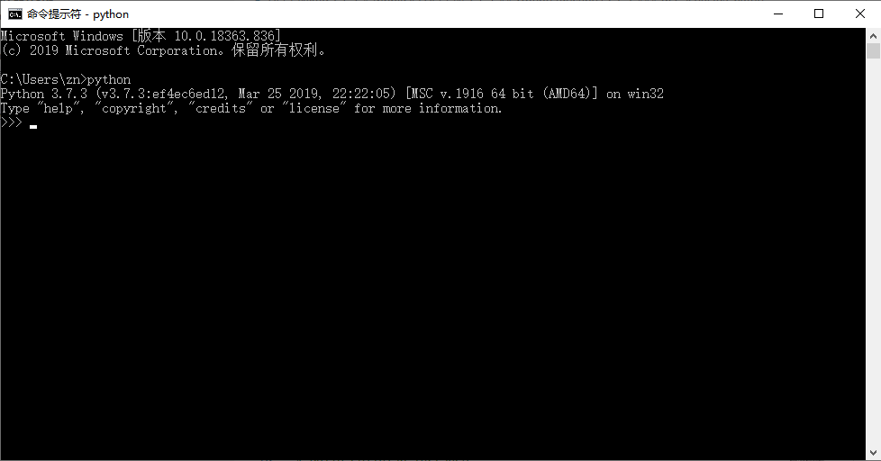

# MobiusPi API手册

- [MobiusPi API手册](#mobiuspi-api手册)
  - [概述](#概述)
  - [安装SDK](#安装sdk)
  - [Python要求](#python要求)
  - [1. Basic](#1-basic)
    - [入门](#入门)
    - [常规使用流程](#常规使用流程)
    - [方法说明](#方法说明)
      - [reboot()](#reboot)
        - [说明](#说明)
        - [请求参数](#请求参数)
        - [返回](#返回)
  - [2. Cellular](#2-cellular)
    - [入门](#入门-1)
    - [常规使用流程](#常规使用流程-1)
    - [方法说明](#方法说明-1)
      - [get\_modem()](#get_modem)
        - [说明](#说明-1)
        - [请求参数](#请求参数-1)
        - [返回](#返回-1)
        - [异常](#异常)
      - [get\_network()](#get_network)
        - [说明](#说明-2)
        - [请求参数](#请求参数-2)
        - [返回](#返回-2)
        - [异常](#异常-1)
  - [3. Config](#3-config)
    - [入门](#入门-2)
    - [常规使用流程](#常规使用流程-2)
    - [方法说明](#方法说明-2)
      - [get\_app\_path()](#get_app_path)
        - [说明](#说明-3)
        - [请求参数](#请求参数-3)
        - [返回](#返回-3)
      - [get\_app\_log\_path()](#get_app_log_path)
        - [说明](#说明-4)
        - [请求参数](#请求参数-4)
        - [返回](#返回-4)
      - [get\_app\_cfg\_path()](#get_app_cfg_path)
        - [说明](#说明-5)
        - [请求参数](#请求参数-5)
        - [返回](#返回-5)
      - [get\_app\_cfg\_file()](#get_app_cfg_file)
        - [说明](#说明-6)
        - [请求参数](#请求参数-6)
        - [返回](#返回-6)
      - [get\_default\_app\_cfg\_file()](#get_default_app_cfg_file)
        - [说明](#说明-7)
        - [请求参数](#请求参数-7)
        - [返回](#返回-7)
      - [get\_app\_db\_base\_path()](#get_app_db_base_path)
        - [说明](#说明-8)
        - [请求参数](#请求参数-8)
        - [返回](#返回-8)
      - [get\_app\_db\_path()](#get_app_db_path)
        - [说明](#说明-9)
        - [请求参数](#请求参数-9)
        - [返回](#返回-9)
  - [4. GPS](#4-gps)
    - [入门](#入门-3)
    - [常规使用流程](#常规使用流程-3)
    - [方法说明](#方法说明-3)
      - [get\_position\_status()](#get_position_status)
        - [说明](#说明-10)
        - [请求参数](#请求参数-10)
        - [返回](#返回-10)
        - [异常](#异常-2)
  - [5. IO](#5-io)
    - [入门](#入门-4)
    - [常规使用流程](#常规使用流程-4)
    - [方法说明](#方法说明-4)
      - [get\_io\_list()](#get_io_list)
        - [说明](#说明-11)
        - [请求参数](#请求参数-11)
        - [返回](#返回-11)
        - [异常](#异常-3)
      - [get\_io\_info(io\_name)](#get_io_infoio_name)
        - [说明](#说明-12)
        - [请求参数](#请求参数-12)
        - [返回](#返回-12)
        - [异常](#异常-4)
      - [get\_all\_io\_info()](#get_all_io_info)
        - [说明](#说明-13)
        - [请求参数](#请求参数-13)
        - [返回](#返回-13)
        - [异常](#异常-5)
      - [setup\_digital\_io(io\_name, mode)](#setup_digital_ioio_name-mode)
        - [说明](#说明-14)
        - [请求参数](#请求参数-14)
        - [返回](#返回-14)
        - [异常](#异常-6)
      - [setup\_analog\_io(io\_name, mode)](#setup_analog_ioio_name-mode)
        - [说明](#说明-15)
        - [请求参数](#请求参数-15)
        - [返回](#返回-15)
        - [异常](#异常-7)
      - [read\_io(io\_name)](#read_ioio_name)
        - [说明](#说明-16)
        - [请求参数](#请求参数-16)
        - [返回](#返回-16)
        - [异常](#异常-8)
      - [write\_io(io\_name)](#write_ioio_name)
        - [说明](#说明-17)
        - [请求参数](#请求参数-17)
        - [返回](#返回-17)
        - [异常](#异常-9)
  - [6. Serial](#6-serial)
    - [入门](#入门-5)
    - [常规使用流程](#常规使用流程-5)
    - [方法说明](#方法说明-5)
      - [get\_serial232\_path()](#get_serial232_path)
        - [说明](#说明-18)
        - [请求参数](#请求参数-18)
        - [返回](#返回-18)
        - [异常](#异常-10)
      - [get\_serial485\_path()](#get_serial485_path)
        - [说明](#说明-19)
        - [请求参数](#请求参数-19)
        - [返回](#返回-19)
        - [异常](#异常-11)
  - [7. SystemInfo](#7-systeminfo)
    - [入门](#入门-6)
    - [常规使用流程](#常规使用流程-6)
    - [方法说明](#方法说明-6)
      - [get\_system\_info()](#get_system_info)
        - [说明](#说明-20)
        - [请求参数](#请求参数-20)
        - [返回](#返回-20)
        - [异常](#异常-12)

<a id="overview"> </a>  

## 概述
MobiusPi是InGateway系列产品二次开发平台的名称，本文档旨在说明如何调用`mobiuspi_lib`库的API。该库实现了获取MobiusPi的运行状态和调用MobiusPi物理接口等功能。

<a id="installation"> </a>  

## 安装SDK
映翰通提供包含`mobiuspi_lib`库的软件开发工具包（SDK），如需获取MobiusPi的SDK及其功能特性信息，请联系客服。安装和升级SDK请参考[IG902更新软件版本](http://manual.ig.inhand.com.cn/zh_CN/latest/IG902-Quick-Start-Manual-CN.html#update-the-software)。  

<a id="python-requirements"> </a>  

## Python要求
MobiusPi Python SDK适用于Python 3.7和3.8，如果您使用其他版本的Python，则可能导致代码运行异常。
您可以打开命令提示符或启动python IDE，使用`python`命令确认您的Python版本。本文档假设您使用了Python 3.7和3.8。

  

<a id="basic"> </a>  

## 1. Basic

<a id="getting-started1"> </a>  

### 入门
以下是一个重启MobiusPi的示例：  
``` python
# 导入Basic类
from mobiuspi_lib.basic import Basic

# 创建basic实例
basic = Basic()

# 重启MobiusPi
print("will reboot ...")
r = basic.reboot()
print("reboot : %s" % r)
```

<a id="basic-use"> </a>  

### 常规使用流程
你可以将Basic类或者作为子类实例化。常规使用流程如下：

* 创建`basic`实例
* 使用`reboot()`重启MobiusPi

<a id="option-functions1"> </a>  

### 方法说明
#### reboot()
##### 说明
你可以使用该方法重启MobiusPi。

##### 请求参数
None  

##### 返回
- 返回类型  

  str  

- 返回值  

  ```python
  ok
  ```  

- 返回值说明
  - `ok`：MobiusPi重启成功
  - `failed`：MobiusPi重启失败

<a id="cellularapi"> </a>  

## 2. Cellular

<a id="getting-started2"> </a>  

### 入门
以下是一个获取MobiusPi拨号信息的示例：  
``` python
# 导入Cellular类
from mobiuspi_lib.cellular import Cellular

# 创建cellular实例
cellular = Cellular()

# 获取modem信息
modem = cellular.get_modem()
print("get modem: %s" % modem)
```

示例的输出结果如下：  
``` python
get modem: {
    "active_sim": "SIM 1",
    "imei_code": "811622048741556",
    "imsi_code": "411220441893359",
    "iccid_code": "84463317227780999882",
    "phone_number": "+8611162203133",
    "signal_level": 0,
    "dbm": 113,
    "rerp": 0,
    "rerq": 0,
    "register_status": 0,
    "operator": "CHN-CT",
    "apns": "",
    "network_type": "4G",
    "lac": "BB00",
    "cell_id": "DD788B81"
}
```

<a id="cellular-use"> </a>  

### 常规使用流程
你可以将Cellular类或者作为子类实例化。常规使用流程如下：

* 创建`cellular`实例
* 使用`get_modem()`获取Modem状态信息
* 使用`get_network()`获取网络连接信息

<a id="option-functions2"> </a>  

### 方法说明

<a id="get-modem"> </a>  

#### get_modem()
##### 说明
你可以使用该方法获取Modem状态信息。

##### 请求参数
None  

##### 返回
- 返回类型  

  dict  

- 返回值  

  ```python
  {
      "active_sim": "SIM 1",
      "imei_code": "811622048741556",
      "imsi_code": "411220441893359",
      "iccid_code": "84463317227780999882",
      "phone_number": "+8611162203133",
      "signal_level": 0,
      "dbm": 113,
      "rerp": 0,
      "rerq": 0,
      "register_status": 0,
      "operator": "CHN-CT",
      "apns": "",
      "network_type": "4G",
      "lac": "BB00",
      "cell_id": "DD788B81"
  }
  ```  

- 返回值说明
  - `active_sim`(string)：当前 SIM 卡
  - `imei_code`(string)：IMEI 号码,未获取到时返回`空字符串`
  - `imsi_code`(string)：IMSI 号码,未获取到时返回`空字符串`
  - `iccid_code`(string)：ICCID 号码,未获取到时返回`空字符串`
  - `phone_number`(string)：电话号码,未获取到时返回`空字符串`
  - `signal_level`(int)：信号值
  - `dbm`(int)：dBm值
  - `rerp`(int)：RSRP，预留参数
  - `rerq`(int)：RSRQ，预留参数
  - `register_status`(int)：注册状态
    - `0`：正在注册到网络
    - `1`：注册网络成功
    - `5`：注册网络成功，漫游状态
    - `6`：尚未注册到网络
    - `7`：未注册
  - `operator`(string)：运营商,未获取到时返回`空字符串`
  - `apns`(string)：APN，预留参数
  - `network_type`(string)：网络类型,未获取到时返回`空字符串`
  - `lac`(string)：位置区码,未获取到时返回`空字符串`
  - `cell_id`(string)：小区 ID,未获取到时返回`空字符串`

##### 异常
当请求超时时，返回如下错误：
```python
KeyError: 'Connection Timeout'
```

<a id="get-network"> </a>  

#### get_network()
##### 说明
你可以使用该方法获取网络连接信息。

##### 请求参数
None  

##### 返回
- 返回类型  

  list  

- 返回值  

  ```python
  [
  {
      'status': 0,
      'ip_addr': '0.0.0.0',
      'netmask': '0.0.0.0',
      'gateway': '0.0.0.0',
      'dns': '0.0.0.0',
      'mtu': 1200,
      'connect_time': 0
  }]
  ```

- 返回值说明
  - `status`(int)：网络状态
    - `0`：未连接
    - `1`：已连接
  - `ip_addr`(string)：IP 地址
  - `netmask`(string)：子网掩码
  - `gateway`(string)：网关
  - `dns`(string)：DNS
  - `mtu`(int)：MTU
  - `connect_time`(int)：连接时间，单位为秒

##### 异常
当请求超时时，返回如下错误：
```python
KeyError: 'Connection Timeout'
```

<a id="config"> </a>  

## 3. Config

<a id="getting-started3"> </a>  

### 入门
以下是一个获取App路径及App配置文件路径的示例：   
``` python
# 导入Config类
from mobiuspi_lib.config import Config

# 创建config实例，该实例对应的App名称为HelloWorld。如果实例化config时，/var/user/app/路径下没有指定的App，则会给出异常提示“FileExistsError: Invalid app_name, do not find app HelloWorld”。
config = Config(app_name="HelloWorld")

# 获取App路径
get_app_path = config.get_app_path()
print("get_app_path: %s" % get_app_path)

# 获取App配置文件夹路径
get_app_cfg_path = config.get_app_cfg_path()
print("get_app_cfg_path: %s" % get_app_cfg_path)
```

示例的输出结果如下：  
```python
get_app_path: /var/user/app/HelloWorld
get_app_cfg_path: /var/user/cfg/HelloWorld
```

<a id="config-use"> </a>  

### 常规使用流程
你可以将`Config`类或者作为子类实例化。常规使用流程如下：

* 创建`config`实例
* 使用`get_app_path()`获取App路径
* 使用`get_app_cfg_path()`获取App配置文件夹路径

<a id="option-functions3"> </a>  

### 方法说明

<a id="get-app-path"> </a>  

#### get_app_path()
##### 说明
你可以使用该方法获取获取App路径。  

##### 请求参数
None  

##### 返回
- 返回类型  

  str  

- 返回值  

  ```python
  /var/user/app/HelloWorld
  ```

<a id="get-app-log-path"> </a>  

#### get_app_log_path()
##### 说明
你可以使用该方法获取获取App日志文件路径。  

##### 请求参数
None  

##### 返回
- 返回类型  

  str  

- 返回值  

  ```python
  /var/user/log/HelloWorld
  ```

<a id="get-app-cfg-path"> </a>  

#### get_app_cfg_path()
##### 说明
你可以使用该方法获取获取App配置文件夹路径。 

##### 请求参数
None  

##### 返回
- 返回类型  

  str  

- 返回值  

  ```python
  /var/user/cfg/HelloWorld
  ```

<a id="get-app-cfg-file"> </a>  

#### get_app_cfg_file()
##### 说明
你可以使用该方法获取获取当前App配置文件路径。  

##### 请求参数
None  

##### 返回
- 返回类型  

  str  

- 返回值  

  ```python
  /var/user/app/HelloWorld/config.yaml
  ```

<a id="get-default-app-cfg-file"> </a>  

#### get_default_app_cfg_file()
##### 说明
你可以使用该方法获取获取默认App配置文件路径。  

##### 请求参数
None  

##### 返回
- 返回类型  

  str  

- 返回值  

  ```python
  /var/user/app/HelloWorld/config.yaml
  ```

<a id="get-app-db-base-path"> </a>  

#### get_app_db_base_path()
##### 说明
你可以使用该方法获取获取数据库home路径。  

##### 请求参数
None  

##### 返回
- 返回类型  

  str  

- 返回值  

  ```python
  /var/user/data/dbhome
  ```

<a id="get-app-db-path"> </a>  

#### get_app_db_path()
##### 说明
你可以使用该方法获取获取App数据库路径。  

##### 请求参数
None  

##### 返回
- 返回类型  

  str  

- 返回值  

  ```python
  /var/user/data/dbhome/HelloWorld
  ```

<a id="gps"> </a>  

## 4. GPS

<a id="getting-started4"> </a>  

### 入门
以下是一个获取GPS信息的示例：  
``` python
# 导入GPS类
from mobiuspi_lib.gps import GPS

# 创建gps实例
gps = GPS()

# 获取GPS信息
position_status = gps.get_position_status()
print("position_status: ")
print(position_status)
```

示例的输出结果如下：  
```python
position_status: {
    'gps_enable': 1,
    'gps_time': '2020-06-10  09:31:25',
    'latitude': "30° 35.276870' N",
    'longitude': "104° 3.251330' E",
    'speed': '0.3500 Knots (1knot = 1.852km/h)'
}
```

<a id="gps-use"> </a>  

### 常规使用流程
你可以将GPS类或者作为子类实例化。常规使用流程如下：

* 创建`gps`实例
* 使用`get_position_status()`获取GPS信息

<a id="option-functions4"> </a>  

### 方法说明

<a id="get-position-status"> </a>  

#### get_position_status()
##### 说明
你可以使用该方法获取MobiusPi的GPS信息。

##### 请求参数
None  

##### 返回
- 返回类型  

  dict  

- 返回值  

  ```python
  {
    'gps_enable': 1,
    'gps_time': '2020-06-10  09:31:25',
    'latitude': "30° 35.276870' N",
    'longitude': "104° 3.251330' E",
    'speed': '0.3500 Knots (1knot = 1.852km/h)'
  }
  ```  

- 返回值说明
  - `gps_enable`：GPS启用状态
    - `0`：未启用
    - `1`：启用
  - `gps_time`：定位时间
  - `latitude`：纬度，未获取到时返回`空字符串`
  - `longitude`：经度，未获取到时返回`空字符串`
  - `speed`：速度

##### 异常
当请求超时时，返回如下错误：
```python
KeyError: 'Connection Timeout'
```

<a id="io"> </a>  

## 5. IO

<a id="getting-started5"> </a>  

### 入门
以下是一个获取IO名称，设置指定输入IO模式并读取IO状态以及修改输出IO的示例：  
``` python
# 导入IO类以及IO方法需要用到的变量
from mobiuspi_lib.io import IO, DIGITAL_DRY_CONTACT_MODE, DIGITAL_WET_CONTACT_MODE, DRY_CONTACT_HIGH_VALUE, SHUT_DOWN_MODE, DRY_CONTACT_LOW_VALUE, ANALOG_LOW_A_MODE, ANALOG_HIGH_A_MODE, ANALOG_LOW_V_MODE, ANALOG_HIGH_V_MODE

# 创建io实例
io = IO()

# 获取所有IO名称
io_list = io.get_io_list()
print("io_list: %s " % io_list)

# 设置数字量输入IO的模式
sdi = io.setup_digital_io(io_name="di0", mode=DIGITAL_DRY_CONTACT_MODE)
print("sdi: %s" % sdi)

# 获取指定IO状态
ri0 = io.read_io(io_name="di0")
print("ri0: %s" % ri0)

# 修改数字量输出IO的状态
io.write_io(io_name="do0", value=DRY_CONTACT_HIGH_VALUE)
ro0 = io.read_io(io_name="do0")
print("ro0: %s" % ro0)
```

示例的输出结果如下：
``` python
io_list: ['di0', 'di1', 'di2', 'di3', 'do0', 'do1', 'ai0', 'ai1'] 
sdi: {'index': 0, 'name': 'di0', 'type': 'digital input', 'mode': 'drycontact'}
ri0: LOW
ro0: ON
```

<font color=#FF0000>注意：仅型号为IG902且IO支持AI的型号支持该API，其余型号获取IO状态详见[IO模块](http://manual.ig.inhand.com.cn/zh_CN/latest/IG502-Quick-Start-Manual-CN.html#io)。</font>  

<a id="io-use"> </a>  

### 常规使用流程
你可以将IO类或者作为子类实例化。常规使用流程如下：

* 创建`io`实例
* 使用`get_io_list()`获取所有IO名称
* 使用`setup_digital_io()`设置数字量输入IO
* 使用`setup_analog_io()`设置模拟量输入IO
* 使用`read_io(io_name="")`获取IO状态
* 使用`write_io()`修改数字量输出IO状态


<a id="option-functions5"> </a>  

### 方法说明

<a id="get-io-list"> </a>  

#### get_io_list()
##### 说明
你可以使用该方法获取所有IO名称。

##### 请求参数
None  

##### 返回
- 返回类型  

  list  

- 返回值  

  ```python
  ['di0', 'di1', 'di2', 'di3', 'do0', 'do1', 'ai0', 'ai1']
  ```  

- 返回值说明  
  di0~di3分别为数字量输入DIO~DI3，do0和do1分别为数字量输出DO0和DO1，ai0和ai1分别为AI0和AI1。

##### 异常
当请求超时时，返回如下错误：
```python
KeyError: 'Connection Timeout'
```

<a id="get-io-info"> </a>  

#### get_io_info(io_name)
##### 说明
你可以使用该方法获取指定IO的类型、模式等信息。

##### 请求参数
- `io_name`：IO名称  

##### 返回
- 返回类型  

  dict  

- 返回值  

  ```python
  {
    'index': 0,
    'name': 'di0',
    'type': 'digital input',
    'mode': 'drycontact'
  }
  ```  

- 返回值说明  
  - `index`：索引号
  - `name`：IO名称
  - `type`：IO类型
    - `digital input`：数字量输入
    - `digital output`：数字量输出
    - `analog input`：模拟量输入
  - `mode`：IO模式
    - 数字量输入IO
      - `wetcontact`：湿接点
      - `drycontact`：干接点
      - `shutdown`：关闭
    - 数字量输出IO
      - `connect`：闭合
      - `break`：断开
    - 模拟量输入IO
      - `0_20mA`：对应0-20mA
      - `4_20mA`：对应4-20mA
      - `0_5V`：对应0-5V
      - `0_10V`：对应0-10V
      - `shutdown`：关闭

##### 异常
- io_name为错误的IO名称时（如`dd1`），返回如下错误：
  ```python
  KeyError: 'Invalid io_name'
  ```

- 当请求超时时，返回如下错误：
  ```python
  KeyError: 'Connection Timeout'
  ```

<a id="get-all-io-info"> </a>  

#### get_all_io_info()
##### 说明
你可以使用该方法获取所有IO的类型、模式等信息。

##### 请求参数
None

##### 返回
- 返回类型  

  list  

- 返回值  

  ```python
  [{
      'index': 0,
      'name': 'di0',
      'type': 'digital input',
      'mode': 'drycontact'
  }, {
      'index': 1,
      'name': 'di1',
      'type': 'digital input',
      'mode': 'wetcontact'
  }, {
      'index': 2,
      'name': 'di2',
      'type': 'digital input',
      'mode': 'shutdown'
  }, {
      'index': 3,
      'name': 'di3',
      'type': 'digital input',
      'mode': 'drycontact'
  }, {
      'index': 0,
      'name': 'do0',
      'type': 'digital output',
      'mode': 'connect'
  }, {
      'index': 1,
      'name': 'do1',
      'type': 'digital output',
      'mode': 'break'
  }, {
      'index': 0,
      'name': 'ai0',
      'type': 'analog input',
      'mode': '4_20mA'
  }, {
      'index': 1,
      'name': 'ai1',
      'type': 'analog input',
      'mode': '0_5V'
  }]
  ```  

- 返回值说明  
  - `index`：索引号
  - `name`：IO名称
  - `type`：IO类型
    - `digital input`：数字量输入
    - `digital output`：数字量输出
    - `analog input`：模拟量输入
  - `mode`：IO模式
    - 数字量输入IO
      - `wetcontact`：湿接点
      - `drycontact`：干接点
      - `shutdown`：关闭
    - 数字量输出IO
      - `connect`：闭合
      - `break`：断开
    - 模拟量输入IO
      - `0_20mA`：对应0-20mA
      - `4_20mA`：对应4-20mA
      - `0_5V`：对应0-5V
      - `0_10V`：对应0-10V
      - `shutdown`：关闭

##### 异常
当请求超时时，返回如下错误：
```python
KeyError: 'Connection Timeout'
```

<a id="setup-digital-io"> </a>  

#### setup_digital_io(io_name, mode)
##### 说明
你可以使用该方法设置指定数字量输入IO的模式。

##### 请求参数
- `io_name`：IO名称<font color=#FF0000>（仅支持设置数字量输入IO）</font>  
- `mode`：数字量输入IO模式
  - `DIGITAL_DRY_CONTACT_MODE`：干接点模式
  - `DIGITAL_WET_CONTACT_MODE`：湿接点模式
  - `SHUT_DOWN_MODE`：关闭

##### 返回
- 返回类型  

  dict  

- 返回值  

  ```python
  {
    'index': 0,
    'name': 'di0',
    'type': 'digital input',
    'mode': 'drycontact'
  }
  ```  

- 返回值说明  
  - `index`：索引号
  - `name`：IO名称
  - `type`：IO类型
    - `digital input`：数字量输入
  - `mode`：IO模式
    - `wetcontact`：湿接点
    - `drycontact`：干接点
    - `shutdow`n：关闭

##### 异常
- io_name为错误的IO名称时（如`dd1`），返回如下错误：
  ```python
  KeyError: 'Invalid io_name'
  ```

- 输入数字量输出IO或模拟量输入IO名称时（如`do0`），返回如下错误：
  ```python
  KeyError: 'Parameter Conflict'
  ```

- 输入错误的模式名称时（如`1234`），返回如下错误：
  ```python
  KeyError: 'Invalid mode'
  ```

- 当请求超时时，返回如下错误：
  ```python
  KeyError: 'Connection Timeout'
  ```

- 当MobiusPi繁忙时，返回如下错误：
  ```python
  KeyError: 'Device Busy'
  ```

<a id="setup-analog-io"> </a>  

#### setup_analog_io(io_name, mode)
##### 说明
你可以使用该方法设置指定模拟量输入IO的模式。

##### 请求参数
- `io_name`：IO名称<font color=#FF0000>（仅支持设置模拟量输入IO）</font>  
- `mode`：模拟量输入IO模式
  - `ANALOG_LOW_A_MODE`：0-20mA模式
  - `ANALOG_HIGH_A_MODE`：4-20mA模式
  - `ANALOG_LOW_V_MODE`：0-5V模式
  - `ANALOG_HIGH_V_MODE`：0-10V模式
  - `SHUT_DOWN_MODE`：关闭

##### 返回
- 返回类型  

  dict  

- 返回值  

  ```python
  {
    'index': 0,
    'name': 'ai0',
    'type': 'analog input',
    'mode': '4_20mA'
  }
  ```  

- 返回值说明  
  - `index`：索引号
  - `name`：IO名称
  - `type`：IO类型
    - `analog input`：模拟量输入
  - `mode`：IO模式
      - `0_20mA`：对应0-20mA
      - `4_20mA`：对应4-20mA
      - `0_5V`：对应0-5V
      - `0_10V`：对应0-10V
      - `shutdown`：关闭

##### 异常
- io_name为错误的IO名称时（如`dd1`），返回如下错误：
  ```python
  KeyError: 'Invalid io_name'
  ```

- 输入数字量输入IO或数字量输出IO名称时（如`do0`），返回如下错误：
  ```python
  KeyError: 'Parameter Conflict'
  ```

- 输入错误的模式名称时（如`1234`），返回如下错误：
  ```python
  KeyError: 'Invalid mode'
  ```

- 当请求超时时，返回如下错误：
  ```python
  KeyError: 'Connection Timeout'
  ```

- 当MobiusPi繁忙时，返回如下错误：
  ```python
  KeyError: 'Device Busy'
  ```

<a id="read-io"> </a>  

#### read_io(io_name)
##### 说明
你可以使用该方法读取IO的状态。

##### 请求参数
- `io_name`：IO名称  

##### 返回
- 返回类型  

  str  

- 返回值  

  ```python
  LOW
  ```  

- 返回值说明  
  - `ON`
    - 数字量输入IO的模式为湿接点且输入电压为+10~+30V时返回`ON`
    - 数字量输出IO为闭合状态时返回`ON`
  - `OFF`：
    - 数字量输入IO的模式为湿接点且输入电压为0~+3V时返回`OFF`
    - 数字量输出IO为断开状态时返回`OFF`
  - `LOW`：数字量输入IO的模式为干接点且断开时返回`LOW`
  - `HIGH`：数字量输入IO的模式为干接点且闭合时返回`HIGH`
  - 模拟量输入的电流或电压值

##### 异常
- io_name为错误的IO名称时（如`dd1`），返回如下错误：
  ```python
  KeyError: 'Invalid io_name'
  ```

- 当请求超时时，返回如下错误：
  ```python
  KeyError: 'Connection Timeout'
  ```

<a id="write-io"> </a>  

#### write_io(io_name)
##### 说明
你可以使用该方法修改数字量输出IO的状态。

##### 请求参数
- `io_name`：数字量输出IO名称  
- `value`：数字量输出IO的设定值
  - `DRY_CONTACT_LOW_VALUE`：设置数字量输出IO断开
  - `DRY_CONTACT_HIGH_VALUE`：设置数字量输出IO闭合

##### 返回
- 返回类型  

  str  

- 返回值  

  ```python
  TRUE
  ```  

- 返回值说明  
  - TRUE：下发成功

##### 异常
- io_name为错误的IO名称时（如`dd1`），返回如下错误：
  ```python
  KeyError: 'Invalid io_name'
  ```

- 输入数字量输入IO或模拟量输入IO名称时（如`do0`），返回如下错误：
  ```python
  KeyError: 'Invalid Parameter'
  ```

- 输入错误的设定值时（如`1234`），返回如下错误：
  ```python
  KeyError: 'Invalid value'
  ```

- 当请求超时时，返回如下错误：
  ```python
  KeyError: 'Connection Timeout'
  ```

- 当MobiusPi繁忙时，返回如下错误：
  ```python
  KeyError: 'Device Busy'
  ```

<a id="serial"> </a>  

## 6. Serial

<a id="getting-started6"> </a>  

### 入门
以下是一个获取232/485串口路径的示例：  
``` python
# 导入Serial类
from mobiuspi_lib.serial import Serial

# 创建serial实例  
serial = Serial()

# 获取232路径
path_232 = serial.get_serial232_path()
print("232 path: %s" % path_232)

# 获取485路径
path_485 = serial.get_serial485_path()
print("485 path: %s" % path_485)
```

示例的输出结果如下：  
```python
232 path: /dev/ttyO1
485 path: /dev/ttyO3
```
<a id="serial-use"> </a>  

### 常规使用流程
你可以将`Serial`类或者作为子类实例化。常规使用流程如下：

* 创建`serial`实例
* 使用`get_serial232_path()`获取232串口路径
* 使用`get_serial485_path()`获取485串口路径

<a id="option-functions6"> </a>  

### 方法说明

<a id="get-serial232-path"> </a>  

#### get_serial232_path()
##### 说明
你可以使用该方法获取232串口路径。  

##### 请求参数
None  

##### 返回
- 返回类型  

  str  

- 返回值  

  ```python
  /dev/ttyO1
  ```

- 返回值说明
  - `/dev/ttyO5`：使用IG501时返回此数值
  - `/dev/ttyO1`：使用IG902/502时返回此数值
  - `/dev/ttyXRUSB1`：使用IG974时返回此数值

##### 异常
当请求超时时，返回如下错误：
```python
KeyError: 'Connection Timeout'
```

<a id="get-serial485-path"> </a>  

#### get_serial485_path()
##### 说明
你可以使用该方法获取485串口路径。  

##### 请求参数
None  

##### 返回
- 返回类型  

  str  

- 返回值  

  ```python
  /dev/ttyO3
  ```
- Return structure
  - `/dev/ttyO1`：使用IG501时返回此数值
  - `/dev/ttyO3`：使用IG902/502时返回此数值
  - `/dev/ttyXRUSB0`：使用IG974时返回此数值

##### 异常
当请求超时时，返回如下错误：
```python
KeyError: 'Connection Timeout'
```

<a id="systeminfo"> </a>  

## 7. SystemInfo

<a id="getting-started7"> </a>  

### 入门
以下是一个获取MobiusPi系统信息的示例：  
``` python
# 导入SystemInfo类
from mobiuspi_lib.systeminfo import SystemInfo

# 创建sysinfo实例
sysinfo = SystemInfo()

# 获取MobiusPi系统信息
get_system_info = sysinfo.get_system_info()
print("get system info: %s" % get_system_info)
```

示例的输出结果如下：  
```python
get system info: {
    'language': 'Chinese',
    'hostname': 'InGateway',
    'model_name': 'IG902H',
    'oem_name': 'inhand',
    'serial_number': 'GT902XXXXXXXXXX',
    'mac_addr1': '00:XX:XX:XX:XX:XX',
    'mac_addr2': '00:XX:XX:XX:XX:XX',
    'firmware_version': '2.0.0.r12644',
    'bootloader_version': '2017.01.r10517',
    'product_number': 'TH09-W-RE',
    'description': 'www.inhand.com.cn',
    'auto_save': 1,
    'encrypt_passwd': 1
}
```
<a id="systeminfo-use"> </a>  

### 常规使用流程
你可以将SystemInfo类或者作为子类实例化。常规使用流程如下：

* 创建`sysinfo`实例
* 使用`get_system_info()`获取MobiusPi系统信息

<a id="option-functions7"> </a>  

### 方法说明

<a id="get-system-info"> </a>  

#### get_system_info()
##### 说明
你可以使用该方法获取MobiusPi系统信息。

##### 请求参数
None  

##### 返回
- 返回类型  

  dict  

- 返回值  

  ```python
  {
    'language': 'Chinese',
    'hostname': 'InGateway',
    'model_name': 'IG902H',
    'oem_name': 'inhand',
    'serial_number': 'GT902XXXXXXXXXX',
    'mac_addr1': '00:XX:XX:XX:XX:XX',
    'mac_addr2': '00:XX:XX:XX:XX:XX',
    'firmware_version': '2.0.0.r12644',
    'bootloader_version': '2017.01.r10517',
    'product_number': 'TH09-W-RE',
    'description': 'www.inhand.com.cn',
    'auto_save': 1,
    'encrypt_passwd': 1
  }
  ```  

- 返回值说明
  - `language`：语言
    - `Chinese`：中文
    - `English`：英语
  - `hostname`：MobiusPi名称 
  - `model_name`：MobiusPi型号
  - `oem_name`：oem名称
  - `serial_number`：MobiusPi序列号
  - `mac_addr1`：MobiusPi MAC地址1
  - `mac_addr2`：MobiusPi MAC地址2
  - `firmware_version`：固件版本
  - `bootloader_version`：Bootloader版本
  - `product_number`：产品编号
  - `description`：产品描述
  - `auto_save`：是否自动保存修改后的配置
    - `0`：未自动保存
    - `1`：自动保存
  - `encrypt_passwd`：是否加密明文密码
    - `0`：未加密
    - `1`：加密

##### 异常
当请求超时时，返回如下错误：
```python
KeyError: 'Connection Timeout'
```