# **MobiusPi Python开发快速入门**
北京映翰通网络技术股份有限公司的InGateway系列产品包含两个大的产品系列，InGateway902和InGateway501系列，以下文档中将InGateway501简称为“IG501”；InGateway902简称为“IG902”。  </br>
MobiusPi是InGateway系列产品二次开发平台的名称，本文档旨在为用户说明如何利用MobiusPi进行基于Python的二次开发。

  - [1. 搭建MobiusPi开发环境](#build-a-mobiuspi-development-environment)
    - [1.1 准备硬件设备及其网络环境](#prepare-hardware-equipment-and-its-network-environment)
      - [1.1.1 接通电源并使用网线连接PC](#turn-on-the-power-and-use-a-network-cable-to-connect-to-the-pc)
      - [1.1.2 访问MobiusPi](#set-lan-network-parameters)
      - [1.1.3 MobiusPi联网](#set-wan-network-parameters)
      - [1.1.4 更新软件版本](#update-ingateway-device-software-version)
      - [1.1.5 启用MobiusPi的调试模式](#enable-mobiuspi-debug-mode)
    - [1.2 PC环境准备](#install-the-required-software-on-the-pc)
      - [1.2.1 安装Python解释器](#install-the-python-interpreter)
      - [1.2.2 安装Visual Studio Code软件](#install-visual-studio-code-software)
      - [1.2.3 安装OpenSSH](#install-openssh)
    - [1.3 准备VS Code开发环境](#prepare-vs-code-development-environment)
      - [1.3.1 安装VS Code扩展插件](#install-vs-code-extension)
      - [1.3.2 配置Python解释器版本](#configure-python-interpreter-version)
      - [1.3.3 配置工程模板](#configure-project-template)
        - [1.3.3.1 使用映翰通标准工程模板](#use-yinghantong-standard-engineering-template)
        - [1.3.3.2 自定义工程模板](#custom-project-template)
  - [2. 编写一个MobiusPi App：Hello World](#write-the-mobiuspi-app-hello-world)
    - [2.1 使用模板创建工程](#create-a-project-using-a-template)
    - [2.2 编码](#coding)
    - [2.3 调试](#debug)
      - [2.3.1 建立SFTP连接](#establish-an-sftp-connection)
      - [2.3.2 调试代码](#debug-code)
    - [2.4 构建App发布包](#build-app)
    - [2.5 通过MobiusPi Web页面部署App](#deploy-app-via-mobiuspi-web-page)
    - [2.6 查看App运行状态](#view-the-running-status-of-the-app)
    - [2.7 为App更新配置文件](#update-configuration-file-for-app)
    - [2.8 附录](#appendix)
      - [2.8.1 为指定App安装第三方依赖库](#install-third-party-dependent-libraries-for-the-specified-app)
      - [2.8.2 安装第三方依赖库至SDK](#install-third-party-dependent-libraries-to-sdk)
      - [2.8.3 启用代码自动补全](#enable-code-completion)
  - [FAQ](#faq)
    - [建立SFTP连接时提示远程主机标识更新，认证失败](#remote-host-id-update)
    - [代码同步到远程服务器时提示“配置的身份验证方法失败”](#the-configured-authentication-method-failed)
    - [如何调用MobiusPi的串口和网口](#how-to-call-the-serial-port-and-network-port-of-ig900)
    - [与MobiusPi建立SFTP连接时提示“SSH错误”](#ssh-error-when-setting-up-sftp-connection-with-mobiuspi)

<a id="build-a-mobiuspi-development-environment"> </a>  

## 1. 搭建MobiusPi开发环境
在进行开发前，您需要具备以下条件：
- InGateway
  - InGateway501
    - 固件版本：V2.0.0.r12351及以上
    - SDK版本：py2sdk-V1.3.4及以上
    - 联网并已启用调试模式
  - InGateway902
    - 固件版本：V2.0.0.r12537及以上
    - SDK版本：py3sdk-V1.3.5及以上
    - 联网并已启用调试模式
- PC
  - Python 2.7.X/3.7.X解释器
  - Visual Studio Code软件
    - Python插件
    - Project Templates插件
    - SFTP插件
  - OpenSSH

如果您的MobiusPi和PC已经满足了以上所有条件，则可以跳过这一小节。否则请参考以下说明准备开发环境。 

- [1.1 准备硬件设备及其网络环境](#prepare-hardware-equipment-and-its-network-environment)
- [1.2 PC环境准备](#install-the-required-software-on-the-pc)
- [1.3 准备VS Code开发环境](#prepare-vs-code-development-environment)

<a id="prepare-hardware-equipment-and-its-network-environment"> </a>  

### 1.1 准备硬件设备及其网络环境

- [1.1.1 接通电源并使用网线连接PC](#turn-on-the-power-and-use-a-network-cable-to-connect-to-the-pc)
- [1.1.2 访问MobiusPi](#set-lan-network-parameters)
- [1.1.3 MobiusPi联网](#set-wan-network-parameters)
- [1.1.4 更新软件版本](#update-ingateway-device-software-version)
- [1.1.5 启用MobiusPi的调试模式](#enable-mobiuspi-debug-mode)
 
<a id="turn-on-the-power-and-use-a-network-cable-to-connect-to-the-pc"> </a>

#### 1.1.1 接通电源并使用网线连接PC
- 准备IG501硬件设备  
  
  接通IG501的电源并按照拓扑使用以太网线连接PC和IG501。  

  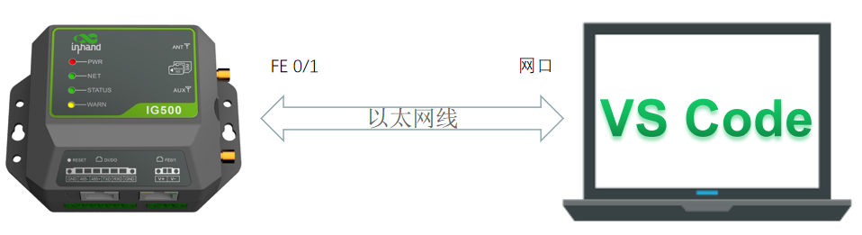  

- 准备IG902硬件设备  
  
  接通IG902的电源并按照拓扑使用以太网线连接PC和IG902。  

  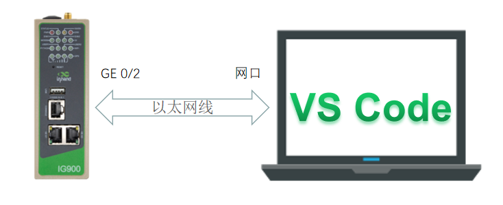  

<a id="set-lan-network-parameters"> </a>  

#### 1.1.2 访问MobiusPi
- 访问IG501，请参考[访问IG501](http://manual.ig.inhand.com.cn/zh_CN/latest/IG501-Quick-Start-Manual-CN.html#set-lan-parameters)。  
- 访问IG902，请参考[访问IG902](http://manual.ig.inhand.com.cn/zh_CN/latest/IG902-Quick-Start-Manual-CN.html#set-lan-parameters)。

<a id="set-wan-network-parameters"> </a>  

#### 1.1.3 MobiusPi联网
- 设置IG501联网请参考[IG501连接Internet](http://manual.ig.inhand.com.cn/zh_CN/latest/IG501-Quick-Start-Manual-CN.html#set-wan-parameters)。  
- 设置IG902联网请参考[IG902连接Internet](http://manual.ig.inhand.com.cn/zh_CN/latest/IG902-Quick-Start-Manual-CN.html#set-wan-parameters)。

<a id="update-ingateway-device-software-version"> </a>  

#### 1.1.4 更新软件版本
如需获取MobiusPi最新软件版本及其功能特性信息，请联系客服。如需更新软件版本，请参考如下链接：  
- [更新IG501软件版本](http://manual.ig.inhand.com.cn/zh_CN/latest/IG501-Quick-Start-Manual-CN.html#update-the-software)  
- [更新IG902软件版本](http://manual.ig.inhand.com.cn/zh_CN/latest/IG902-Quick-Start-Manual-CN.html#update-the-software)

<a id="enable-mobiuspi-debug-mode"> </a>  

#### 1.1.5 启用MobiusPi的调试模式
开发过程中，为了在MobiusPi上运行并调试Python代码，需要启用MobiusPi的调试模式。
- [启用IG501调试模式](http://manual.ig.inhand.com.cn/zh_CN/latest/IG501-Quick-Start-Manual-CN.html#enable-the-debug-mode)
- [启用IG902调试模式](http://manual.ig.inhand.com.cn/zh_CN/latest/IG902-Quick-Start-Manual-CN.html#enable-the-debug-mode)  

<a id="install-the-required-software-on-the-pc"> </a>  

### 1.2 PC环境准备

- [1.2.1 安装Python解释器](#install-the-python-interpreter)
- [1.2.2 安装Visual Studio Code软件](#install-visual-studio-code-software)
- [1.2.3 安装OpenSSH](#install-openssh)  

<a id="install-the-python-interpreter"> </a>  

#### 1.2.1 安装Python解释器
在开发过程中PC需具备Python2.7.X或3.7.X解释器（建议使用3.7.X解释器），您可以访问 [https://www.python.org/downloads/](https://www.python.org/downloads/) 下载相应的安装包并安装至PC。  

  

<a id="install-visual-studio-code-software"> </a>  

#### 1.2.2 安装Visual Studio Code软件
您可以访问：[https://code.visualstudio.com/Download](https://code.visualstudio.com/Download) 获取相应的Visual Studio Code软件（以下简称VS Code）。  

  

下载完成后运行安装程序，安装成功后打开VS Code软件，软件页面如下图。  

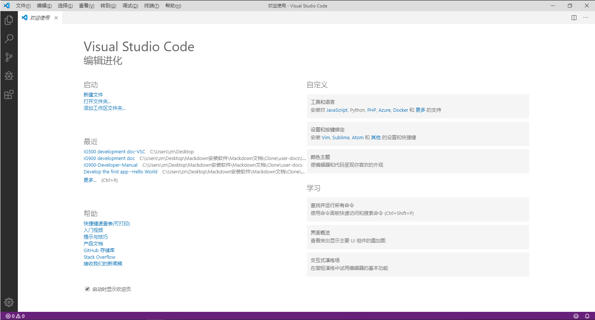

<a id="install-openssh"> </a>  

#### 1.2.3 安装OpenSSH
您可以在命令提示符中输入`ssh`命令查看PC是否支持SSH协议，当PC支持SSH协议时如下图所示：  

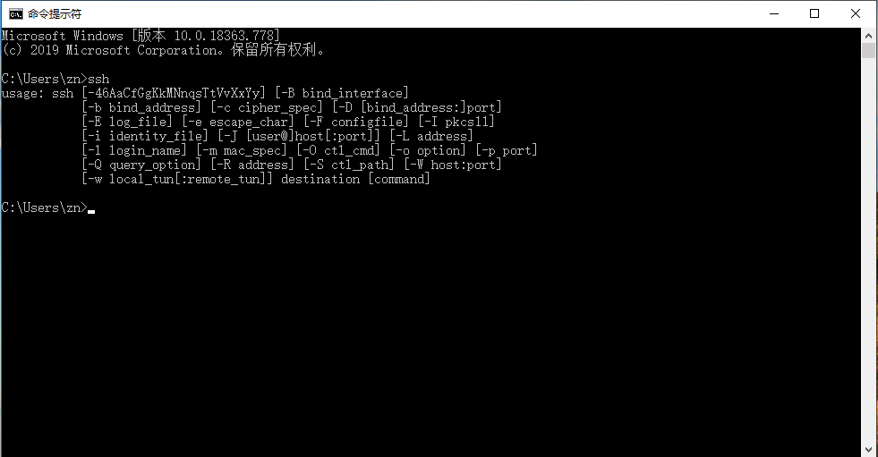  

如果PC不支持SSH协议，您可以访问：[https://www.openssh.com](https://www.openssh.com) 获取相应的OpenSSH工具并安装至PC。  

<a id="prepare-vs-code-development-environment"> </a>  

### 1.3 准备VS Code开发环境

- [1.3.1 安装VS Code扩展插件](#install-vs-code-extension)
- [1.3.2 配置Python解释器版本](#configure-python-interpreter-version)
- [1.3.3 配置工程模板](#configure-project-template)
  - [1.3.3.1 使用映翰通标准工程模板](#use-yinghantong-standard-engineering-template)
  - [1.3.3.2 自定义工程模板](#custom-project-template)

<a id="install-vs-code-extension"> </a>  

#### 1.3.1 安装VS Code扩展插件
为了在MobiusPi上开发并调试Python代码，您要在VS Code IDE的“Extensions”中安装以下必需的扩展插件：  
- `Python`：一个拥有丰富的功能特性的VS Code Python扩展插件，包括诸如IntelliSense、linting、调试、代码导航、代码格式化、Jupyter笔记本支持、重构、变量资源管理器、测试资源管理器、代码片段等功能！想要了解跟多详细信息，请访问该插件的[官方网页](https://code.visualstudio.com/docs/languages/python)。  
- `Project Templates`：一个支持基于自定义模板快速创建新项目的VS Code扩展插件。我们会发布若干Python App模板，您可以使用Project Templates导入模板，并快速初始化项目。  
- `SFTP`：您可以使用SFTP Sync插件将代码上传至MobiusPi中。  

  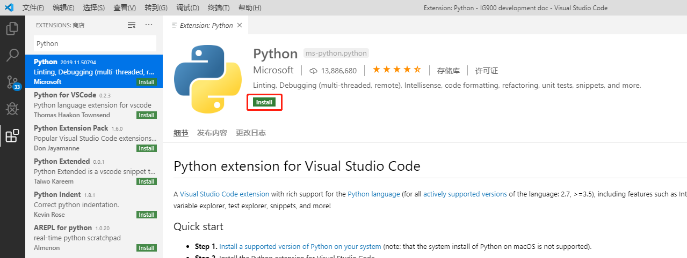  

  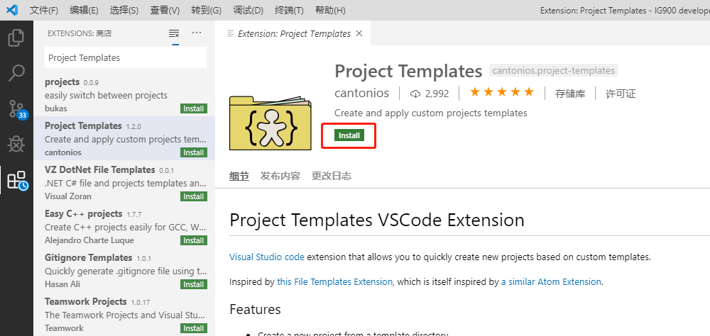  

  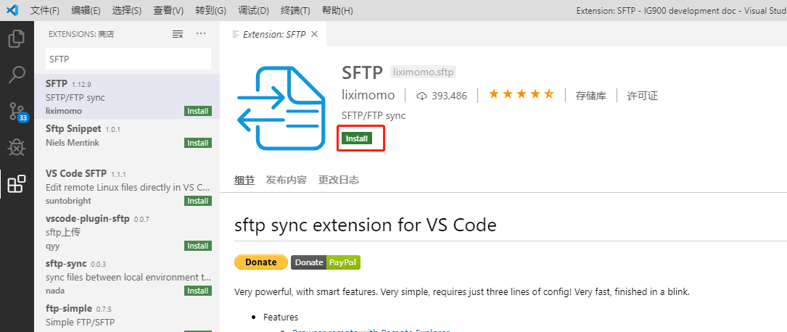  

至此，MobiusPi二次开发平台所必需的插件安装完成。想要了解更多VS Code插件，请访问[Visual Studio Code官网](https://code.visualstudio.com/)。

<a id="configure-python-interpreter-version"> </a>  

#### 1.3.2 配置Python解释器版本
使用快捷键：`Ctrl+Shift+P`弹出命令面板，在命令面板中输入`>Python: select Interpreter`。  

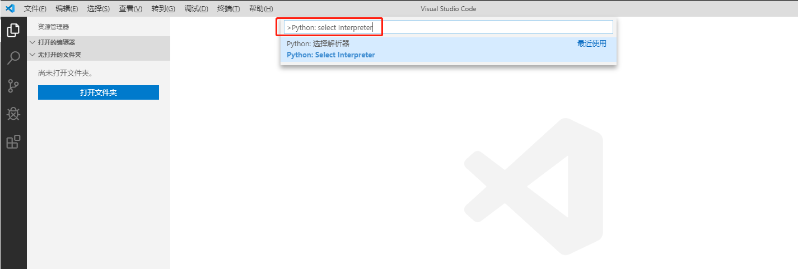  

根据需要选择相应的Python解释器，本教程使用3.7.X版本的Python解释器（所选择的Python解释器版本应同“边缘计算 > Python边缘计算”页面的Python解释器一致）。选择后在VS Code左下角可以看到已选择的Python解释器版本。  

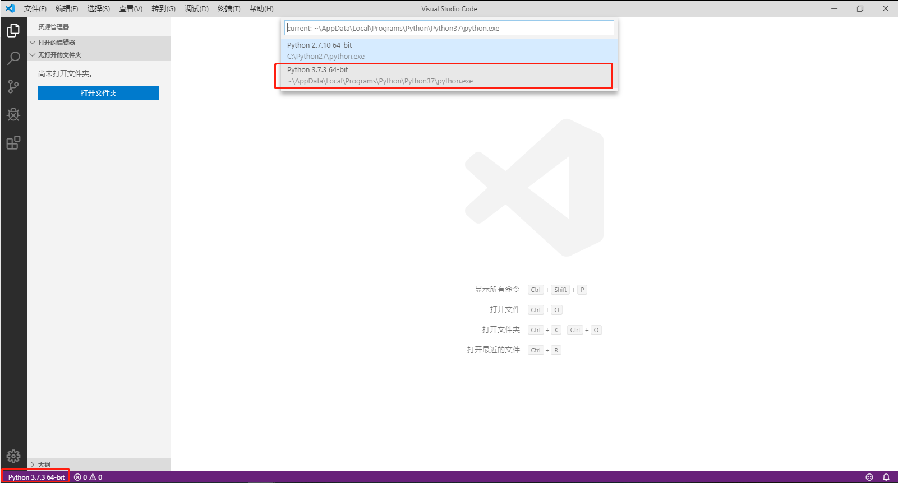

<a id="configure-project-template"> </a>  

#### 1.3.3 配置工程模板

<a id="use-yinghantong-standard-engineering-template"> </a>  

##### 1.3.3.1 使用映翰通标准工程模板
- 步骤1：您可以从[这里](https://github.com/inhandnet/MobiuspiProjectTemplates/releases)下载MobiusPi工程模板。  

  MobiusPi提供多种工程模板以方便您快速初始化工程目录。各工程模板的详细说明请参考[README.md](https://github.com/inhandnet/MobiuspiProjectTemplates)。本教程使用标准工程模板“helloworld-template”进行演示说明。  

  

- 步骤2：打开工程模板。  

  解压下载后的工程模板压缩包，使用VS Code打开解压文件夹中的helloworld-template文件夹，点击“文件 > 打开文件夹”并选择解压后的“helloworld-template”文件夹。
  
  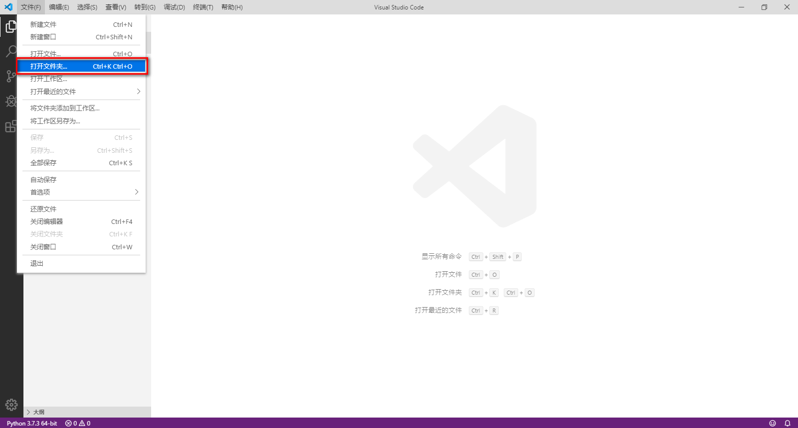  

  打开工程模板文件夹“helloworld-template”后如下图所示，工程模板中包含以下内容：  

  ```
  ├── .vscode
  │  └── sftp.json
  ├── build
  ├── lib
  ├── src
  │  │── main.py
  │  └── parse_config.py
  ├── config.yaml
  └── setup.py
  ```

  - `.vscode`：VS Code配置文件夹
    - `sftp.json`：SFTP插件的配置文件，用于与MobiusPi建立SFTP连接
  - `build`：App发布包文件夹
  - `lib`：App第三方依赖库文件夹
  - `src`：App源码文件夹
    - `main.py`：App入口
    - `parse_config.py`：解析App配置文件
  - `config.yaml`：App配置文件
  - `setup.py`：App版本、SDK版本等信息说明 

  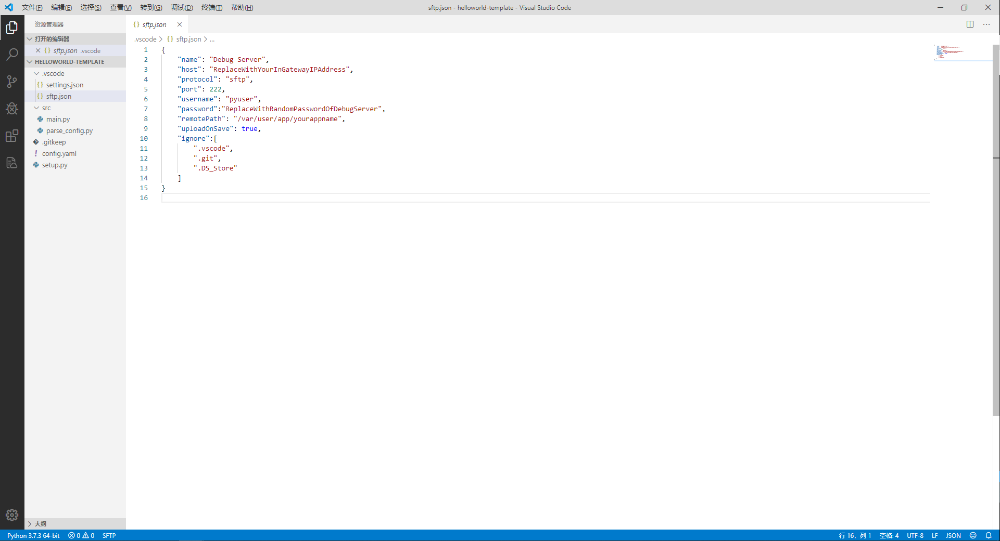  

- 步骤3：在命令面板中输入`>Project:Save Project as Template`命令以将当前工程文件存为模板。  

  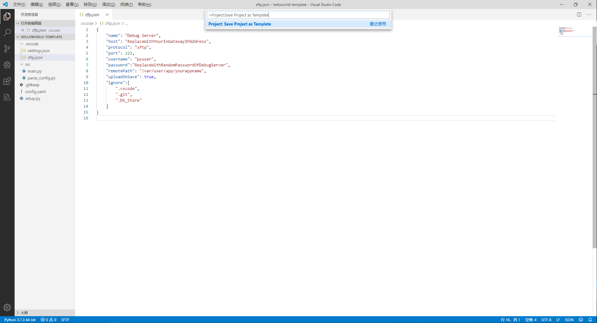  

  定义您模板的名称，如：helloworld-template。  

  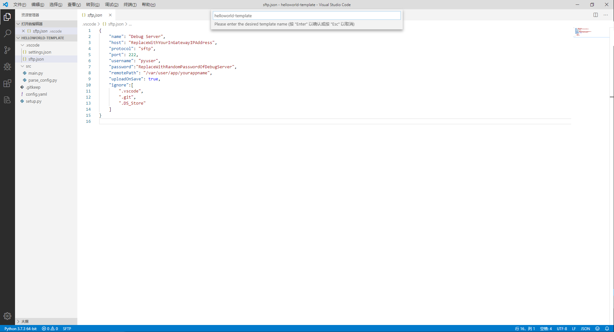

<a id="custom-project-template"> </a>  

##### 1.3.3.2 自定义工程模板
- 步骤1：新建一个工程模板文件夹，文件夹中必须包含以下内容。其他文件可根据您的实际情况自行添加  
  ```
  ├── .vscode
  │  └── sftp.json
  ├── build
  ├── src
  │  └── main.py
  └── setup.py
  ```

  - `.vscode`：VS Code配置文件夹（在VS Code的命令面板中输入`>SFTP:Config` 命令可快速创建.vscode文件夹和sftp.json文件）
    - `sftp.json`：SFTP插件的配置文件，用于与MobiusPi建立SFTP连接
  - `build`：App发布包文件夹
  - `src`：App源码文件夹
    - `main.py`：App入口
  - `setup.py`：App版本、SDK版本等信息说明，建议参照标准模板定义  

- 步骤2：使用VS Code打开自定义工程模板文件夹，点击“文件 > 打开文件夹”并选择的自定义工程模板文件夹。  

- 步骤3：在命令面板中输入`>Project:Save Project as Template`命令以将当前工程文件存为模板。  


<a id="write-the-mobiuspi-app-hello-world"> </a>  

## 2. 编写一个MobiusPi App：Hello World
本教程以开发一个“HelloWorld”App为例说明如何通过VS Code实现MobiusPi Python App的开发。该App具备在MobiusPi中每10秒打印一条“hello world!”日志以及导入配置文件修改日志内容的功能。  

- [2.1 使用模板创建工程](#create-a-project-using-a-template)
- [2.2 编码](#coding)
- [2.3 调试](#debug)
- [2.4 构建App发布包](#build-app)
- [2.5 通过MobiusPi Web页面部署App](#deploy-app-via-mobiuspi-web-page)
- [2.6 查看App运行状态](#view-the-running-status-of-the-app)
- [2.7 为App更新配置文件](#update-configuration-file-for-app)
- [2.8 附录](#appendix)

<a id="create-a-project-using-a-template"> </a>  

### 2.1 使用模板创建工程
- 步骤1：使用VS Code打开Python App的工程文件夹，打开后如下图所示：  

  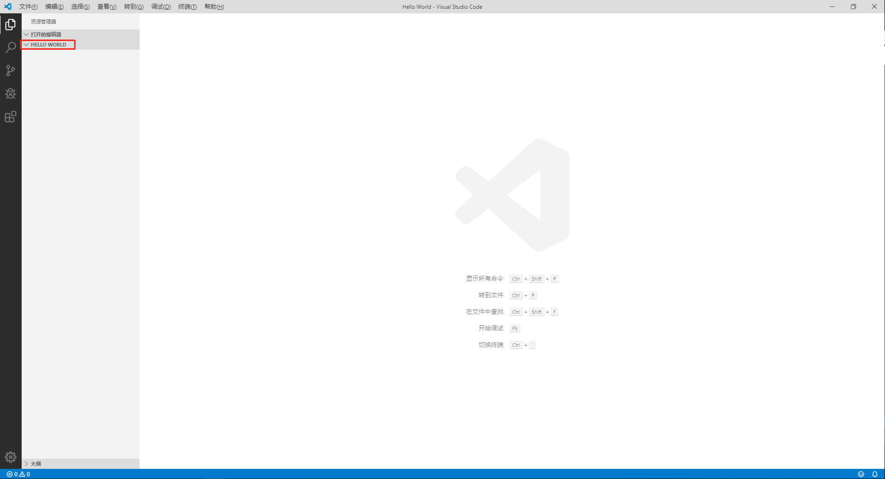  

- 步骤2：在命令面板中输入 `>Project:Create Project From Template`命令以通过已有模板快速创建工程目录。  
  
  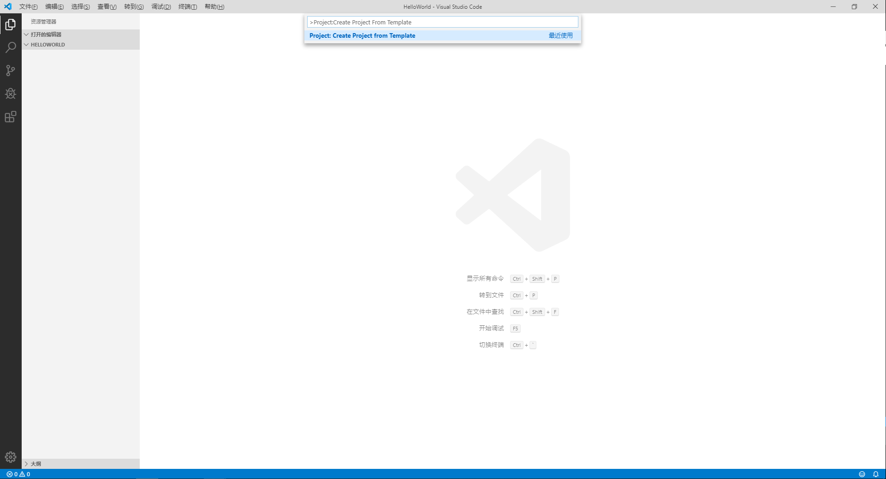  

- 步骤3：输入helloworld-template模板的名称并回车。  

  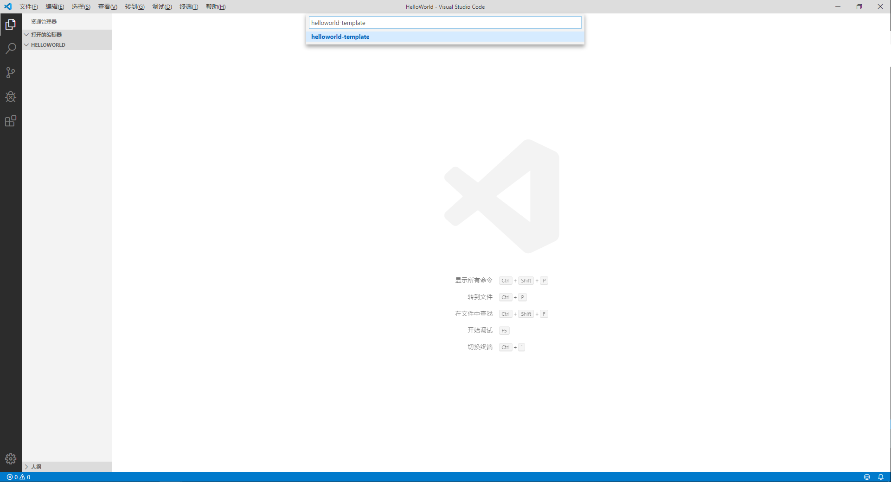  

  选择模板后VS Code会自动在当前工程文件夹下增加模板中包含的文件。  

  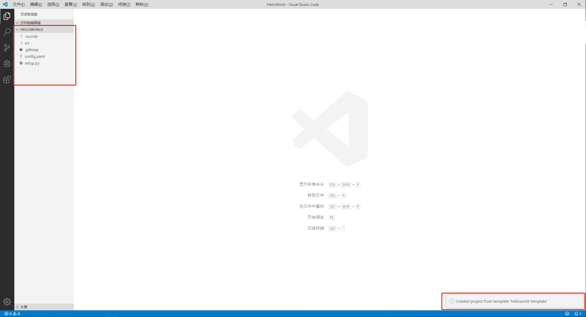  

<a id="coding"> </a>  

### 2.2 编码
标准工程模板“helloworld-template”已经实现了在MobiusPi中每10秒打印一条“hello world!”日志以及导入配置文件修改日志内容的功能。如需修改App名称，请您参考下图修改`main.py`和`setup.py`中的代码。<font color=#FF0000>注意：Python App名称中不能包含空格。</font>  

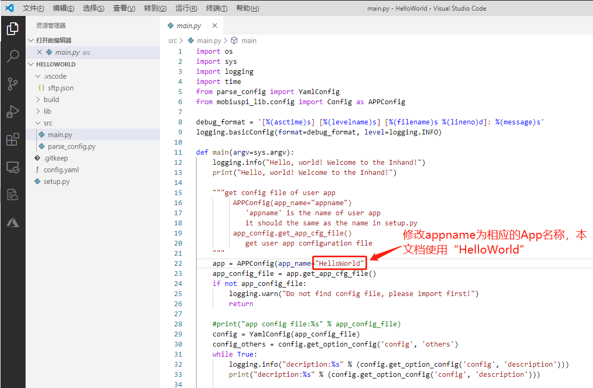  

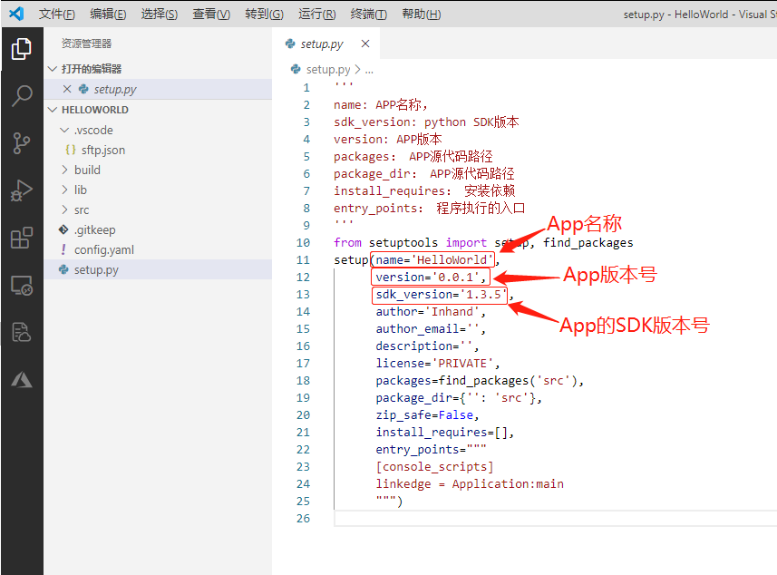  

</a> <a id="debug"> </a>   

### 2.3 调试

- [2.3.1 建立SFTP连接](#establish-an-sftp-connection)
- [2.3.2 调试代码](#debug-code)

<a id="establish-an-sftp-connection"> </a>  

#### 2.3.1 建立SFTP连接
远程调试代码时需要先将本地代码上传到远程服务器（即MobiusPi）。上传本地代码前需要确认MobiusPi的调试模式已启用，启用调试模式后如下图所示：  

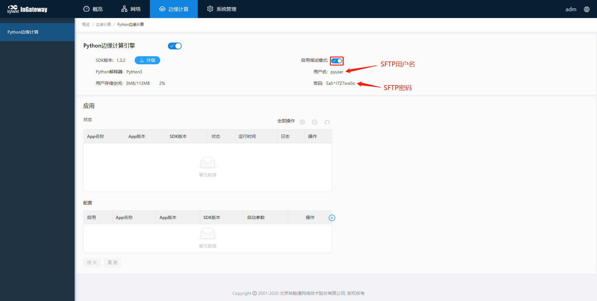  

- 步骤1：打开`sftp.json`文件  
  
  在命令面板中输入`>SFTP:Config` 命令后打开`sftp.json`文件。  

  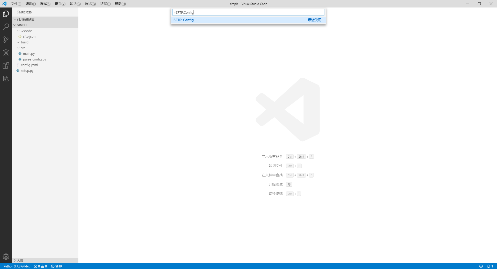  

- 步骤2：配置SFTP连接  
  - 配置IG501 SFTP连接  
  
    在`sftp.json`文件中根据“边缘计算 > Python边缘计算”页面的连接参数配置SFTP连接。
  <font color=#FF0000>注意：Python App名称应与mian.py中的App名称保持一致。</font>  

    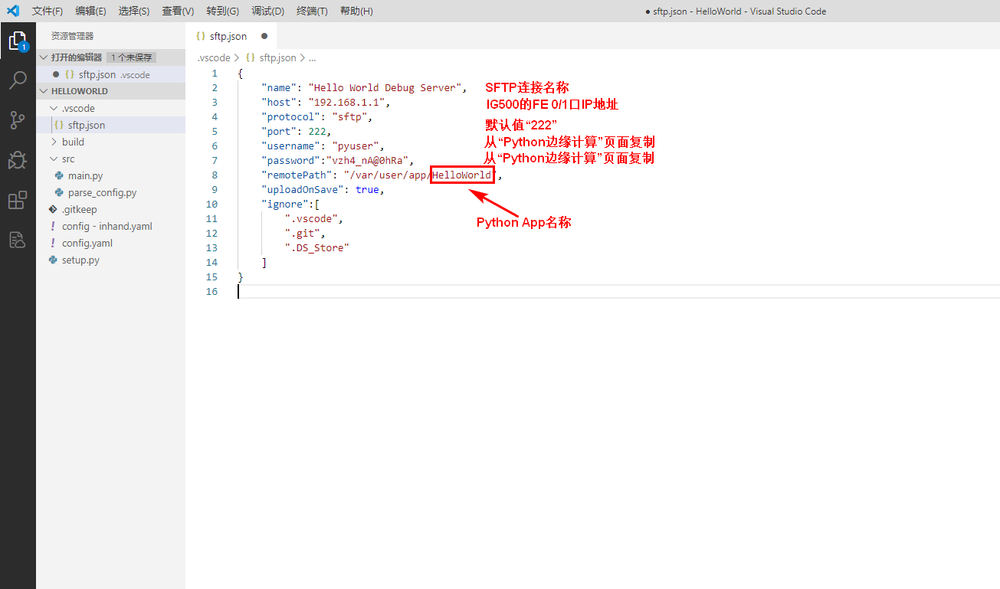  

  - 配置IG902 SFTP连接  
  
    在`sftp.json`文件中根据“边缘计算 > Python边缘计算”页面的连接参数配置SFTP连接。
  <font color=#FF0000>注意：Python App名称应与mian.py中的App名称保持一致。</font>  

    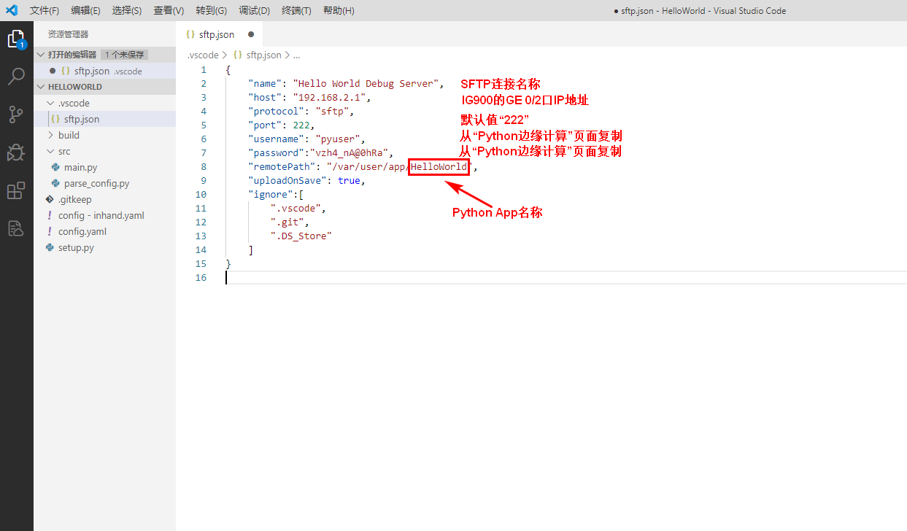  
  
- 步骤3：配置完成并保存后在命令面板中输入`>SFTP:Open SSH in Terminal`以连接远端的服务器。  
  
  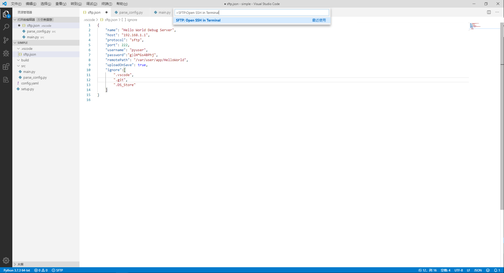  

- 步骤4：随后命令面板会提示您需要选择要连接的SFTP服务器，选择`sftp.json`中的SFTP服务器并回车即可。  

  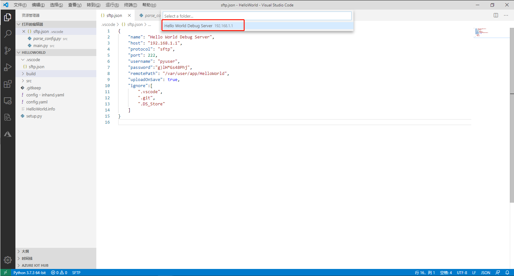

- 步骤5：首次连接时“终端”窗口会提示您是否要继续连接，此时输入“yes”并回车。随后再次在命令面板中输入`>SFTP:Open SSH in Terminal`和SFTP服务器的IP地址。  
  
    

- 步骤6：“终端”窗口会提示您需要输入密码，您只需要将`sftp.json`文件中“password”项复制粘贴到此处即可。  

  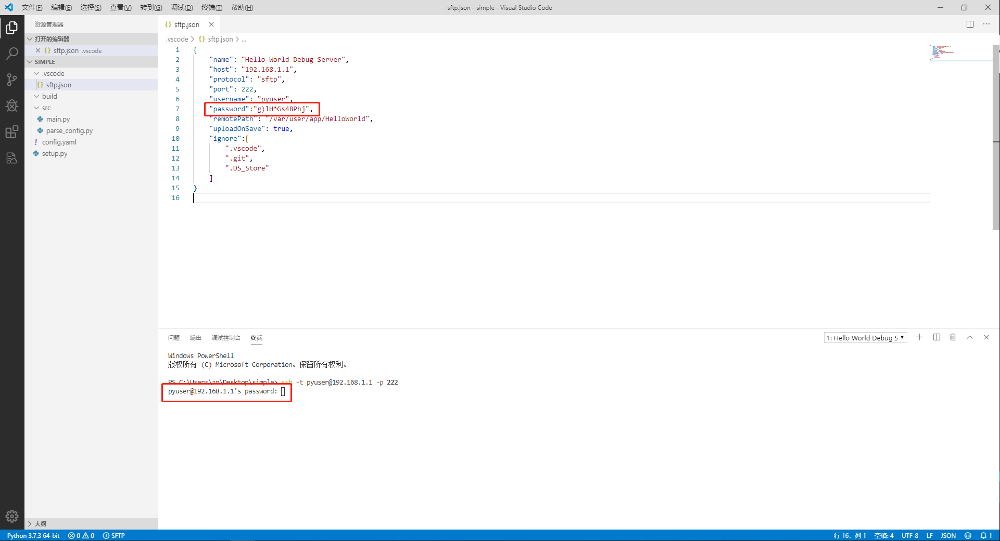  

  成功与MobiusPi建立SFTP连接后如下图所示：  

  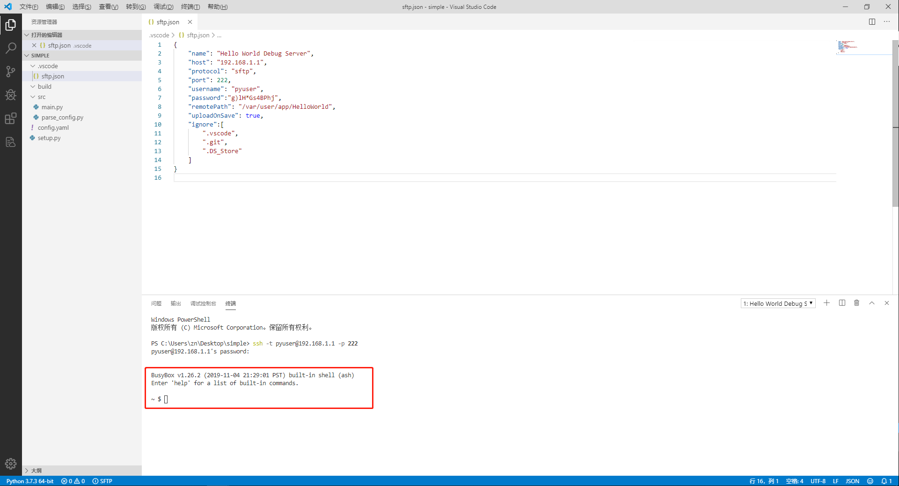

<a id="debug-code"> </a>  

#### 2.3.2 调试代码
- 步骤1：同步代码  
  
  SFTP连接成功后，在左侧空白处右键选择“Sync Local->Remote”将代码同步到远程服务器，同步成功后本地修改或者删除代码时都会自动和远端服务器同步。  

  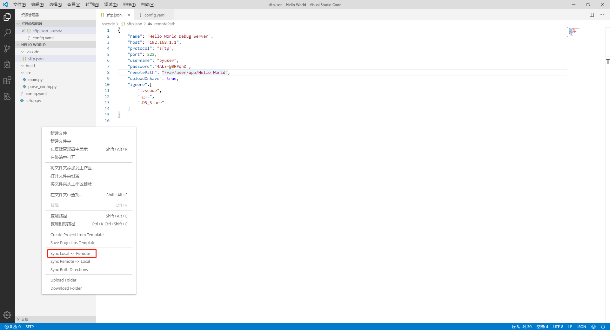  

  可以在TERMINAL窗口查看远程服务器是否已接收到相应的App代码。在TERMINAL窗口输入以下命令查看已上传的App文件夹信息：  
  ```
  cd app  
  ls -l
  ```
  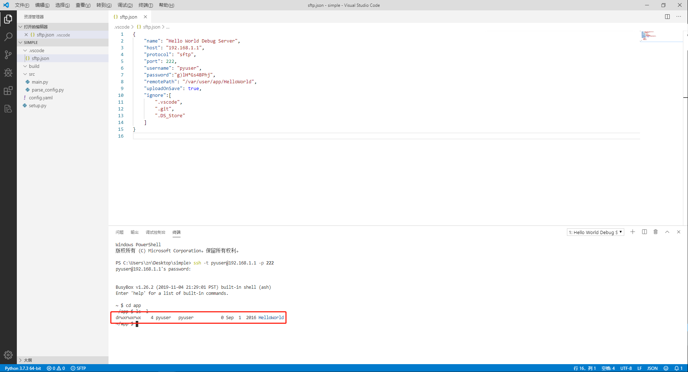  

- 步骤2：在终端窗口调试脚本  
  
  同步代码后在终端窗口输入如下命令在IG501中立即执行脚本，执行脚本后在终端窗口查看执行结果：打印“hello world!”。
  ```
  python -m ptvsd --host 192.168.1.1 --port 3000 HelloWorld/src/main.py 
  ```
  - `192.168.1.1`为`sftp.json`中“host”项配置的IP地址
  - `3000`为建议的调试端口号
  - `HelloWorld/src/main.py`为mian. py的执行路径，请根据您的当前位置适当调整  

  MobiusPi的Python开发环境内置了ptvsd依赖库用于远程调试代码，想要了解更多ptvsd插件的用法，请访问[ptvsd使用说明](https://github.com/microsoft/ptvsd/)。  

  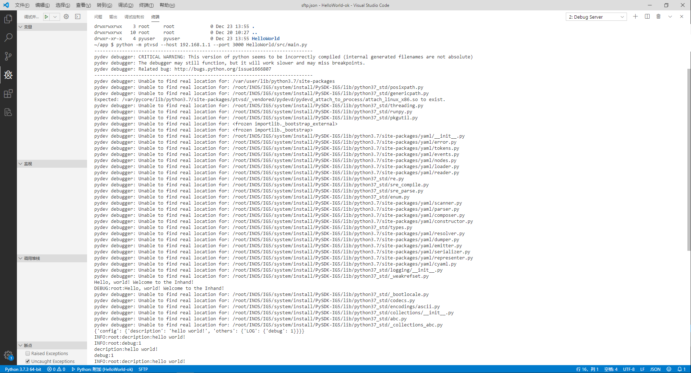  

- 步骤3：调试完成后在终端使用`Ctrl + C`快捷键终止调试。  

  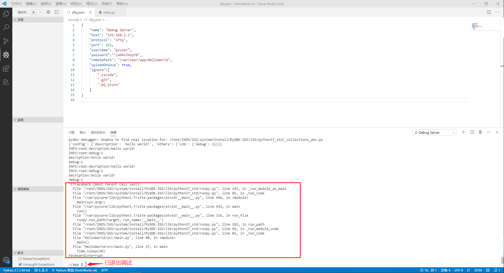

<a id="build-app"> </a>  

### 2.4 构建App发布包
调试完毕后可以构建App发布包以便于将App快速部署至其他MobiusPi。  
- 步骤1：构建App发布包  
  
  在“终端”窗口执行`build_py_app.sh HelloWorld`命令构建App发布包。（即`build_py_app.sh` Python App名称）  

  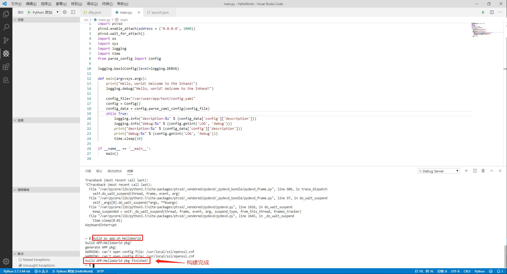  

- 步骤2：下载App发布包  
  
  执行完成后在远程服务器的build目录下会自动生成App发布包。右键本地的“build”文件夹并选择“Download Folder”将构建好的App发布包下载到本地以便于后续部署。  

  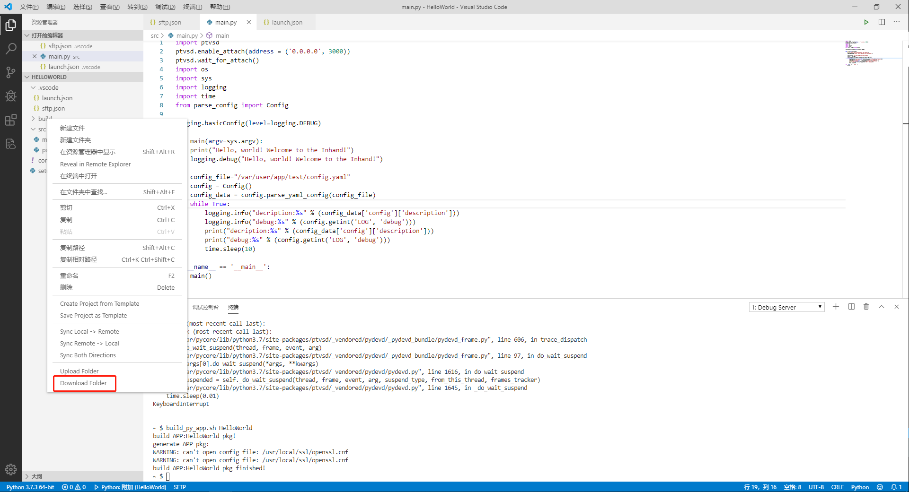  

  下载完成后在build目录下可以看到HelloWorld App发布包。  

  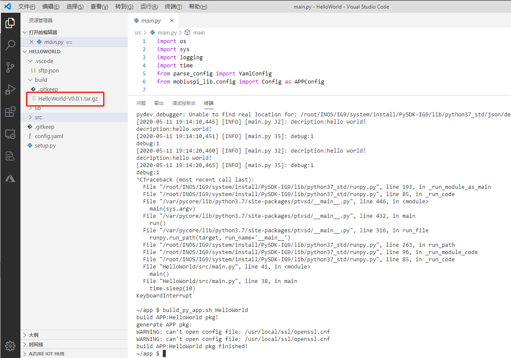

<a id="deploy-app-via-mobiuspi-web-page"> </a>  

### 2.5 通过MobiusPi Web页面部署App
执行`main.py`脚本或构建App发布包命令后会自动在已连接的MobiusPi上生成对应的App,此App无法正常启动。请参考如下链接部署App至MobiusPi：  
- [IG501部署App](http://manual.ig.inhand.com.cn/zh_CN/latest/IG501-Quick-Start-Manual-CN.html#python-app)  
- [IG902部署App](http://manual.ig.inhand.com.cn/zh_CN/latest/IG902-Quick-Start-Manual-CN.html#python-app)

<a id="view-the-running-status-of-the-app"> </a>  

### 2.6 查看App运行状态
在MobiusPi的“边缘计算 > Python边缘计算”页面可查看App的运行状态。  

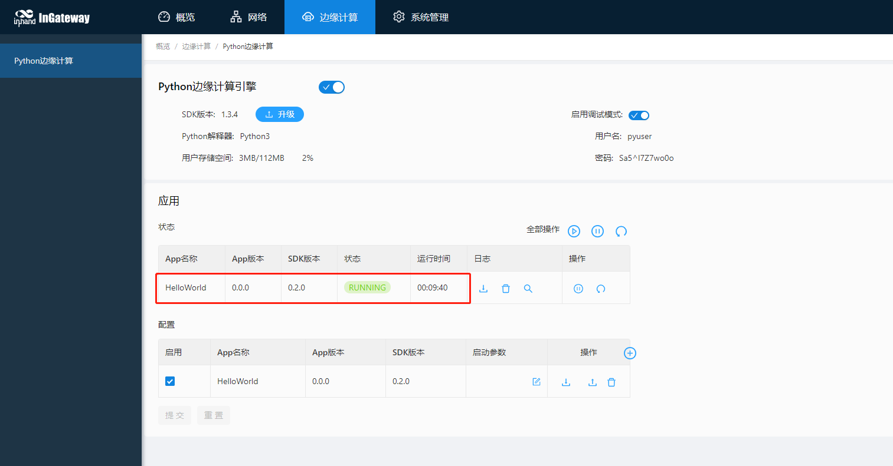  

点击“查看日志”可查看App的运行日志。  

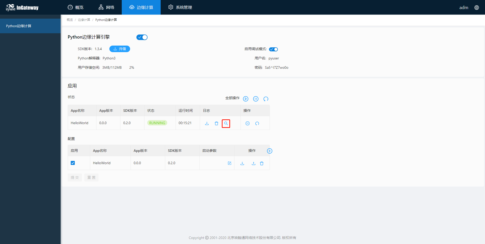   

  

<a id="update-configuration-file-for-app"> </a>  

### 2.7 为App更新配置文件
- 步骤1：修改配置文件  
  
  将App的“config.yaml”中的配置```description: "hello world!"```修改为:```description: "hello inhand!"```  

    

- 步骤2：导入配置文件并重启App  
  
  在MobiusPi的“边缘计算 > Python边缘计算”页面为“HelloWorld”App导入修改后的配置文件并重启App。  

  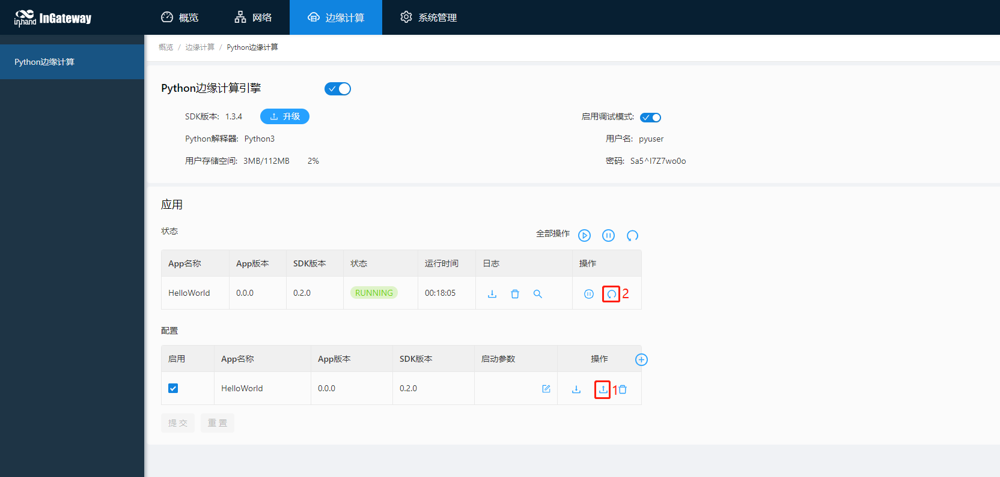  

重启后“HelloWorld”App将按照更新后的配置文件运行，即每10秒打印一条"hello inhand!"日志。  

  

<a id="appendix"> </a>  

### 2.8 附录

- [2.8.1 为指定App安装第三方依赖库](#install-third-party-dependent-libraries-for-the-specified-app)
- [2.8.2 安装第三方依赖库至SDK](#install-third-party-dependent-libraries-to-sdk)
- [2.8.3 启用代码自动补全](#enable-code-completion)

<a id="install-third-party-dependent-libraries-for-the-specified-app"> </a>  

#### 2.8.1 为指定App安装第三方依赖库
为指定App安装第三方依赖库时需启用MobiusPi的调试模式并且接入互联网，以下以HelloWorld App安装`xlrd`依赖库为例说明如何为指定App安装第三方依赖库：  

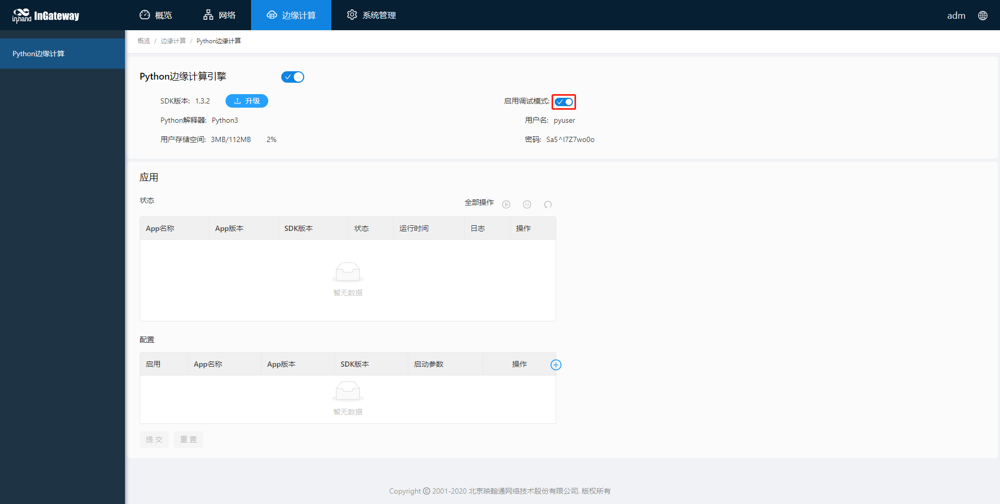  

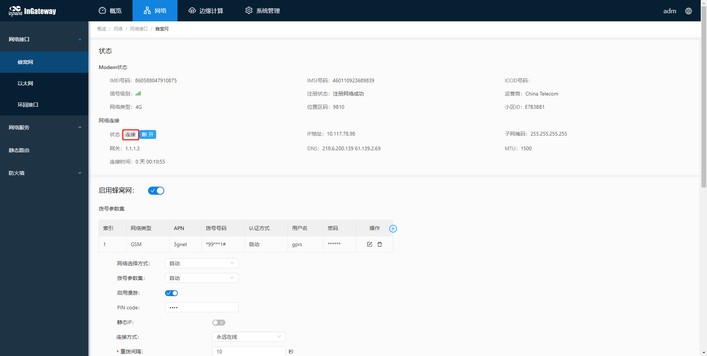  

- 步骤1：使用VS Code与MobiusPi建立SFTP连接，详见[建立SFTP连接](#establish-an-sftp-connection)。  
  
  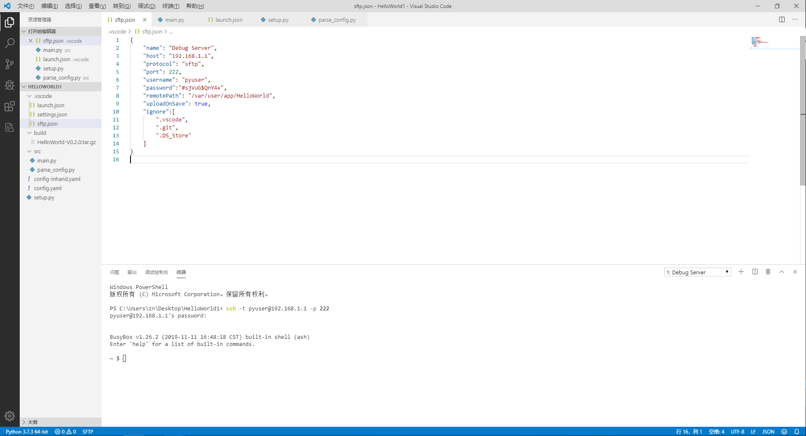  

- 步骤2：执行`pip install` + “依赖库名称” + “==版本号” + `-t` + “App的lib文件夹路径”命令并回车以安装相应依赖库至指定App。（不加版本号时pip会自动安装最新版的依赖库）  
  ```
  pip install xlrd==1.2.0 -t /var/user/app/HelloWorld/lib/
  ```

  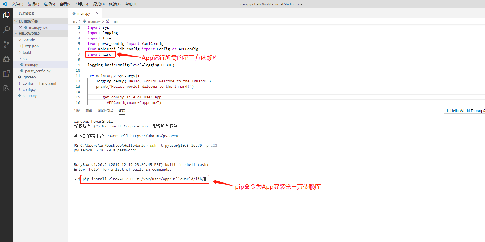  

- 步骤3：随后会自动下载并安装相应的依赖库，安装成功后如下图所示：  
  
  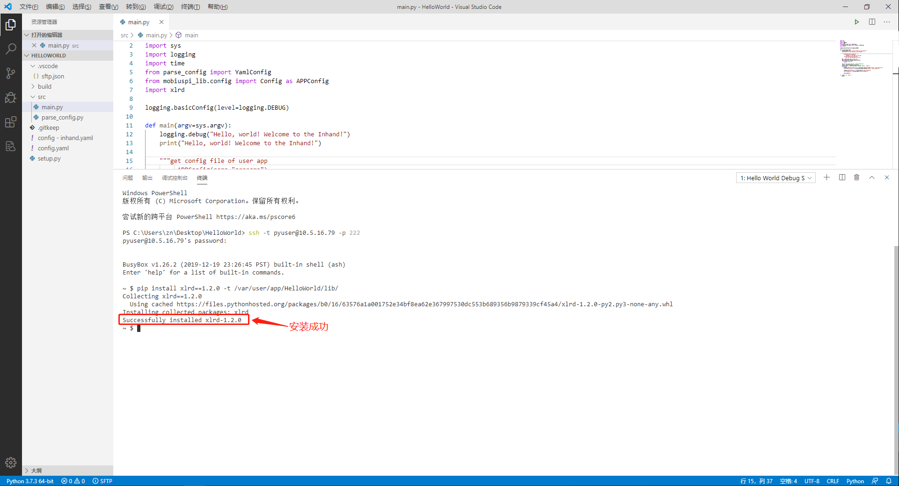  

- 步骤4：使用`export`命令为App设置环境变量。在终端窗口执行以下命令（“HelloWorld”项需要根据实际的App名称调整）  
  ```
  export LD_LIBRARY_PATH=$LD_LIBRARY_PATH:/var/user/app/HelloWorld/lib/  
  export PYTHONPATH=$PYTHONPATH:/var/user/app/HelloWorld/lib/
  ```
  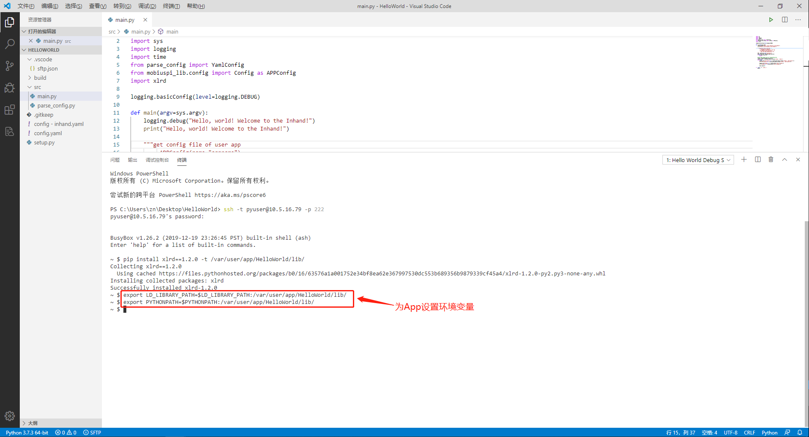  

  为指定App安装第三方依赖库后，调试该App前必须要配置相应的环境变量，否则调试时该App将不能正常运行（安装多个第三方依赖库时仅需要添加一次环境变量即可；重新建立SFTP连接后需要再次配置环境变量）。在MobiusPi中启用App后会自动为该App添加App的lib文件夹下第三方依赖库的环境变量，无须手动配置。<font color=#FF0000>（此方法主要用于App需要安装特殊版本的第三方依赖库）</font>  

- 步骤5：运行代码以确认App运行正常  
  
  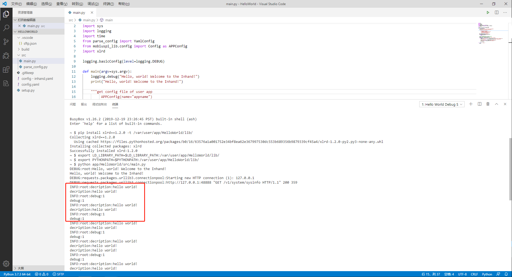

<a id="install-third-party-dependent-libraries-to-sdk"> </a>  

#### 2.8.2 安装第三方依赖库至SDK
安装第三方依赖库至SDK时需启用MobiusPi的调试模式并且接入互联网，以下以安装`xlrd`依赖库至SDK为例说明如何安装第三方依赖库至SDK：  

  

  

- 步骤1：使用VS Code与MobiusPi建立SFTP连接，详见[建立SFTP连接](#establish-an-sftp-connection)。  
  
  

- 步骤2：执行`pip install` + “依赖库名称” + “==版本号” + `--user`命令并回车以安装相应依赖库至SDK。（不加版本号时pip会自动安装最新版的依赖库）  
  ```
  pip install xlrd==1.2.0 --user
  ```

  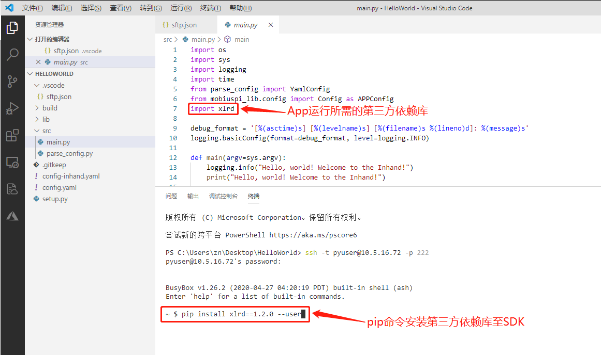  

- 步骤3：随后会自动下载并安装相应的依赖库，安装成功后如下图所示：  
  
  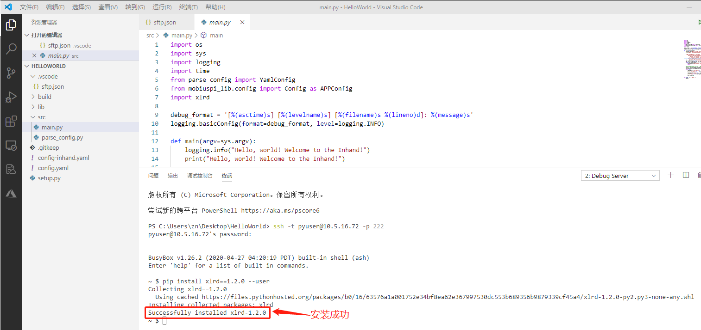  

- 步骤4：运行代码以确认App运行正常  
  
  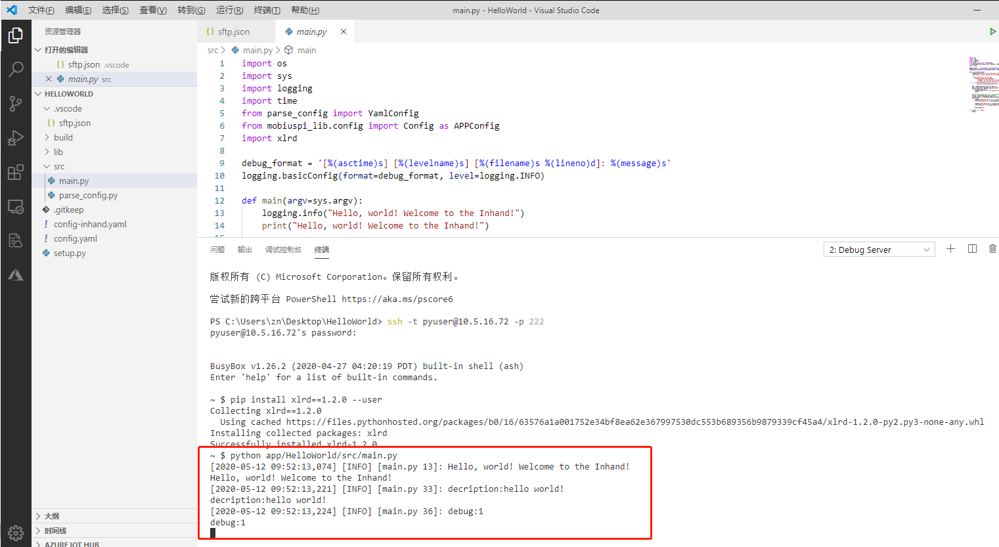  

<font color=#FF0000>说明：使用此方法安装第三方依赖库后打包的App发布包部署到其他MobiusPi上时，将自动安装相应的第三方依赖库至MobiusPi中。</font>

<a id="enable-code-completion"> </a>  

#### 2.8.3 启用代码自动补全
为了提高编码效率，您可以通过Python扩展插件实现代码自动补全功能。  
- 步骤1：点击“文件 > 首选项 > 设置”进入设置页面。  
  
  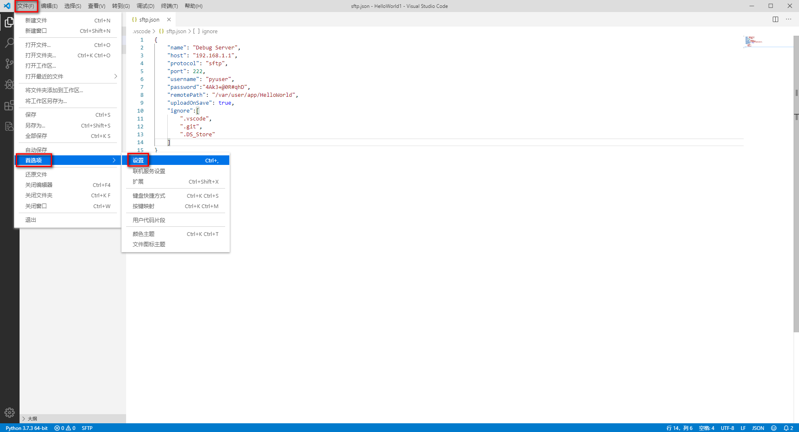  

- 步骤2：选择设置页面中的“扩展 > Python”项，找到“Auto Complete: Extra Paths”项并点击“在setting.json中编辑”。  
  
  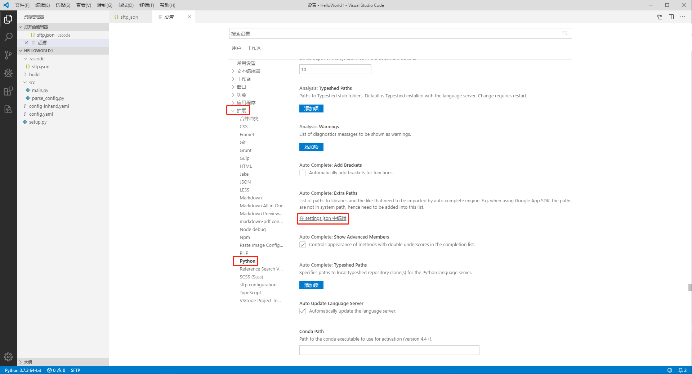  

  在“settings.json”中增加如下配置项并保存（`python.pythonPath`为python解释器的安装路径）  
  ```
  "python.linting.pylintEnabled":false,
  "python.linting.flake8Enabled":true,
  "python.jediEnabled":true,
  "terminal.integrated.rendererType":"dom",
  "explorer.confirmDelete":false,
  "python.pythonPath":"C:/Users/zn/AppData/Local/Programs/Python/Python37",
  ```
  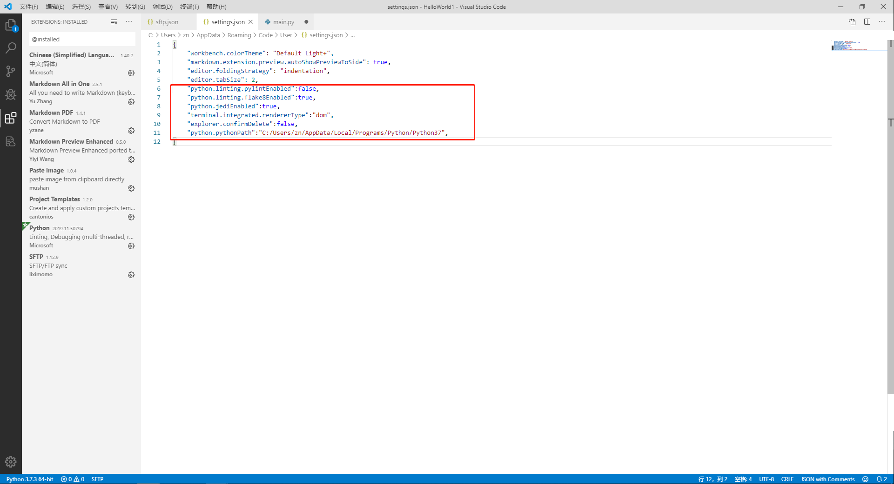  

## FAQ
- [建立SFTP连接时提示远程主机标识更新，认证失败](#remote-host-id-update)
- [代码同步到远程服务器时提示“配置的身份验证方法失败”](#the-configured-authentication-method-failed)
- [如何调用MobiusPi的串口和网口](#how-to-call-the-serial-port-and-network-port-of-ig900)
- [与MobiusPi建立SFTP连接时提示“SSH错误”](#ssh-error-when-setting-up-sftp-connection-with-mobiuspi)  

<a id="remote-host-id-update"> </a>  

### Q1:建立SFTP连接时提示远程主机标识更新，认证失败  
  
  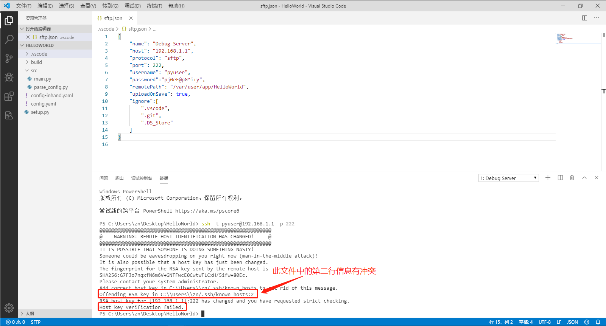  

  A1：出现此问题的原因是因为MobiusPi的密钥更新了，但是PC上的密钥还未更新导致认证失败。此时您只需要删掉密钥文件中有冲突的那一行即可。(按住Ctrl并单击冲突项可以快速访问链接)  

  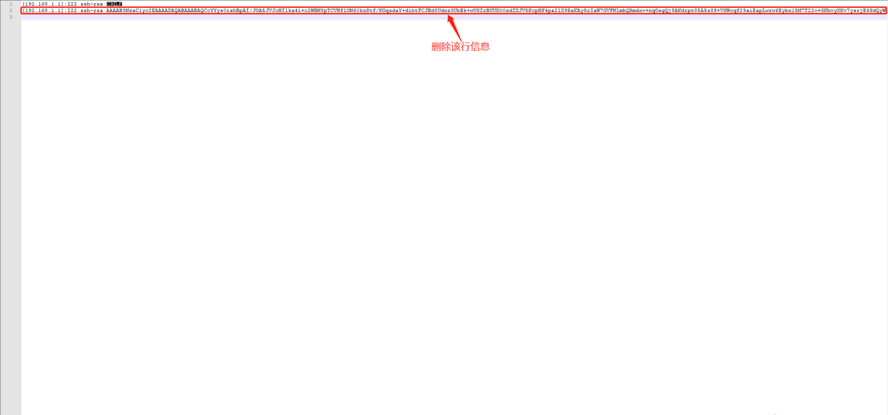  

  删除后再次使用`>SFTP:Open SSH in Terminal`命令即可成功建立SFTP连接。  

  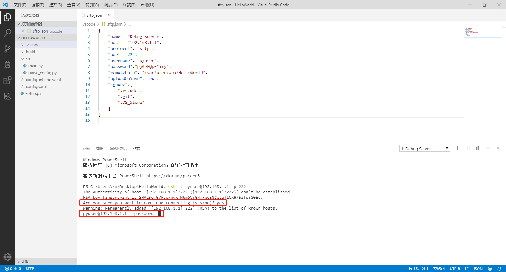  

<a id="the-configured-authentication-method-failed"> </a> 

### Q2:建立SFTP连接后，在左侧空白处右键选择”Sync Local->Remote”将代码同步到远程服务器时提示“配置的身份验证方法失败”  
  
  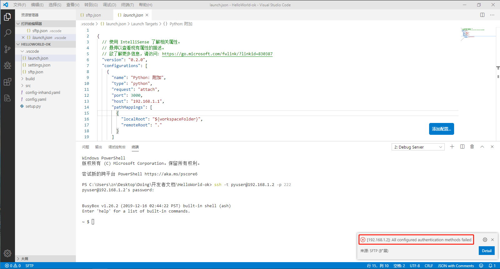  

  A2:确保“sftp.json”文件中的password项与MobiusPi的密码一致。一致后重新同步代码。  

<a id="how-to-call-the-serial-port-and-network-port-of-ig900"> </a>

### Q3：如何调用MobiusPi的串口和网口  
  
  A3：IG902的RS485串口名称为：`/dev/ttyO3`，RS232串口名称为：`/dev/ttyO1`；IG501的RS485串口名称为：`/dev/ttyO1`，RS232串口名称为：`/dev/ttyO5`。串口和网口均可以使用Python标准的串口/网口使用方法进行调用，如使用`pyserial`库调用串口。  

<a id="ssh-error-when-setting-up-sftp-connection-with-mobiuspi"> </a>

### Q4：与MobiusPi建立SFTP连接时提示“SSH错误”，如下图所示：  
  
  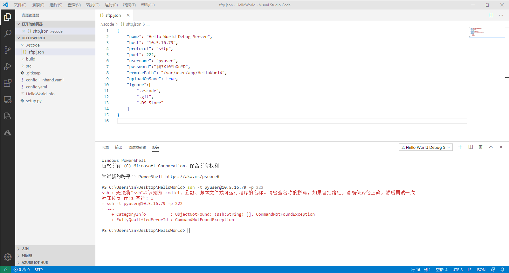  

  A4：请安装OpenSSH工具以支持SSH协议。您可以访问：[https://www.openssh.com](https://www.openssh.com) 获取相应的OpenSSH工具。